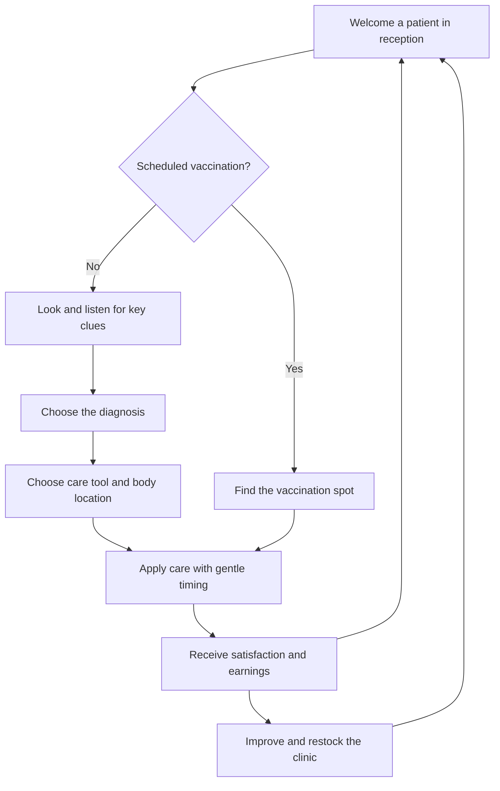

# Louise's Vet Office — master game design

## 1. Authority and status

This is the authoritative product design for Louise's Vet Office. It tells one
continuous story, from welcoming a neighbour to improving the clinic. Read it
alongside [AGENTS.md](../AGENTS.md), which requires its maintenance as the game
changes. [README](../README.md) owns operational instructions;
[asset credits](assets.md) owns provenance and licenses.

The baseline is a working first playable slice: ten authored visits, six species,
an animated office, interactive 3D examinations, gentle care challenges, rewards,
and a small clinic shop. Detailed behavior below describes that slice unless
explicitly labelled otherwise. Current tuning values are adjustable choices,
not permanent constraints.

| Status             | Meaning                                                                    |
| ------------------ | -------------------------------------------------------------------------- |
| Implemented        | Playable within the stated scope, with source and verification references. |
| Partial            | Part of the intended experience works; the remaining boundary is explicit. |
| Approved / planned | Requested product direction not yet playable in the stated scope.          |
| Exploratory        | A possible extension, with no commitment or settled design.                |

Explicit new user direction can revise this design. Code and tests establish
what currently works; they do not silently override product intent. Reconcile
any disagreement in the affected section and feature status in the same change.

### Contents

- [2. Vision and design pillars](#2-vision-and-design-pillars)
- [3. Setting, spaces, and cast](#3-setting-spaces-and-cast)
- [4. The visit loop and its stages](#4-the-visit-loop-and-its-stages)
- [5. Examination and care mechanics](#5-examination-and-care-mechanics)
- [6. Interface, controls, and accessibility](#6-interface-controls-and-accessibility)
- [7. Current case catalogue](#7-current-case-catalogue)
- [8. Economy and clinic progression](#8-economy-and-clinic-progression)
- [9. Art, animation, and sound](#9-art-animation-and-sound)
- [10. Platform, saving, and delivery](#10-platform-saving-and-delivery)
- [11. Feature register and development milestones](#11-feature-register-and-development-milestones)
- [12. Experience acceptance criteria](#12-experience-acceptance-criteria)
- [13. Open decisions and decision history](#13-open-decisions-and-decision-history)
- [14. Implementation and verification map](#14-implementation-and-verification-map)

## 2. Vision and design pillars

Louise runs a welcoming neighbourhood veterinarian office. An owner arrives with
a much-loved animal and a small worry. Louise listens, looks closely, works out
what will help, and gives gentle care. The animal leaves happier, the owner feels
reassured, and the earnings make the next visit a little more comfortable.

The game is made for Louise and suitable for ages 7 and up. The pleasure comes
from noticing a clue, understanding it, and using a tool skilfully. Running the
office gives those caring moments a continuing purpose.

1. **Care comes first.** Pets and people are sympathetic characters. Mistakes
   invite another try; there is no blood, animal death, or punishment for reading
   slowly. Scores acknowledge care quality without making failure frightening.
2. **See and do.** Inspect the actual 3D animal and anatomy, hear the heartbeat,
   and place tools deliberately. Notes reinforce observations the player can
   perceive. Deeper hands-on treatment remains an approved direction.
3. **A clinic that feels alive.** Neighbours approach Louise face to face, people
   and animals walk and idle, and purchases make the office visibly welcoming.
4. **Grow through good care.** Satisfaction and money are the two score tracks.
   Income supports stock, furnishings, equipment, advertising, and more space.
5. **Easy to read, forgiving to control.** Large rounded lettering, visible next
   actions, helpful targeting, and touch/keyboard alternatives support children.

This is fictional storybook care, not veterinary training. Anatomy and readings
are simplified; do not introduce real dosages or instructions for treating real
animals. An emergency/death system or a change in target age would require a
deliberate revision of these pillars.

## 3. Setting, spaces, and cast

### Reception: the 2.5D home view

The isometric office is the player's home between visits. Louise stands behind
the counter at the top/back of the scene and faces arriving customers. Owners
enter from the side doorway and walk up toward the desk. Arrival paths must not
bring customers in behind Louise or turn her away from them.

The waiting list shows each pet's name, appearance/breed, and presenting concern.
The player can call the next patient or choose another waiting patient. Existing
customers retain their places when someone new arrives. A treat shelf, plants,
seating, equipment, advertising, and an annex give purchases a visible home.
Current furniture positions are authored; there is no free-placement editor.

### Examination room: the close-up 3D view

Selecting a patient changes to a full 3D examination-table view. The player can
rotate around the animal and bring tools to its body. Owner story, care notes,
tools, and the next action surround the scene without hiding the patient or
requiring a search for the diagnosis button. Goldfish stay in their travel bowl.

### Louise, neighbours, and pets

Louise is the named vet and welcoming face of the clinic. Her approved portrait
and Blender character use the family reference for a recognisable, gentle
storybook appearance. Provenance belongs in [asset credits](assets.md); the
reference photograph is not a repository or shipped asset.

Customers include women and men, currently represented by three animated models.
Named owners keep a consistent appearance across visits. Six pet species are
modelled: dogs, cats, rabbits, hamsters, gerbils, and goldfish. Individual names
and stories come from the case catalogue; breed labels currently reuse species
models rather than providing distinct geometry for every breed.

## 4. The visit loop and its stages

Two visit routes share reception, care, and rewards:

| Stage            | Player action and feedback                                       | Exit and consequence                                                                                   |
| ---------------- | ---------------------------------------------------------------- | ------------------------------------------------------------------------------------------------------ |
| Welcome          | Read the concern; select a waiting pet.                          | Patient leaves the waiting list and enters the exam room.                                              |
| Investigate      | Use diagnostic tools, inspect anatomy, and collect observations. | Both authored key clues enable **Choose a diagnosis**; other notes remain useful but do not unlock it. |
| Diagnose         | Match the findings to an offered answer.                         | Correct answer reveals care plan; wrong answer gives guidance and allows retry.                        |
| Place care       | Choose the care tool and body spot in the plan.                  | Correct placement starts timing; incorrect choice explains what to try.                                |
| Give gentle care | Stop the moving dot in the green target.                         | A miss leaves care unapplied and allows retry; success completes the visit.                            |
| Celebrate        | Read satisfaction, fee, tip, any treat sale, and aftercare.      | Rewards save once; return to reception.                                                                |
| Improve          | Spend available coins on stock or upgrades.                      | Purchases save and affect subsequent visits.                                                           |

Scheduled vaccination has its own entry stage: read the placement clue, find the
soft upper-body coat spot, and perform the timing challenge. No investigation,
clue collection, or diagnosis is required. The fiction is administering a gentle
vaccine without hurting the pet; a miss gives no vaccine and no injury.

**Stop visit** is available throughout an unfinished visit, including timing. It
cancels the attempt, returns the pet to the front of the queue, and awards no
coins or satisfaction. Starting that visit again clears its clues and mistakes.
Previous completed progress is retained. There is no visit deadline and no
queue-abandonment penalty.

Runtime stages are `reception`, `examine`, `diagnose`, `place-vaccine`, `treat`,
and `result`; timing is a substage of care. Shop, guide, and care notebook are
supporting views, not additional campaign levels.

## 5. Examination and care mechanics

### Finding a clue

Selecting a tool puts its 3D instrument in the player's control. Hold and drag
over the animal to inspect it, or use a labelled body guide to place the tool.
Findings appear in care notes after inspection. Actual mesh targets and anatomical
regions must agree, including either visible ear and the animal's paws; the
player must not need to guess an invisible hotspot.

Each sick visit currently has two key findings. Other sensible checks produce
normal observations or suggest a closer look. An inappropriate tool/location
pair explains where the tool works. Surface inspection must not pronounce a
hidden ear or tooth problem healthy. Magnifier and X-ray clues require the
problem to be visible in the viewer; touching an unrelated or obscured region
must not reveal it automatically.

### Diagnostic instruments

| Instrument   | Where and what the player observes                                                                                                                       |
| ------------ | -------------------------------------------------------------------------------------------------------------------------------------------------------- |
| Magnifier    | Live enlarged coat, skin, paws, and other surfaces; fur fibres, swelling, fleas, tangles, and a protruding splinter distinguish cases.                   |
| X-ray        | Complete species skeleton from the current angle, with zoom and whole-body overview. Pip's front leg has separated, displaced bone ends.                 |
| Ear scope    | Ear contact opens a lit 3D canal. Healthy tissue differs from Milo's red, swollen canal and wax.                                                         |
| Mouth mirror | Mouth contact reveals 3D teeth and gums; healthy teeth, Cleo's tartar, and Poppy's tooth crater are distinct.                                            |
| Stethoscope  | Chest contact drives ECG and an authored heartbeat reading, with matching double-beat sound when enabled. Leaving the chest stops the reading and beats. |
| Water test   | Bowl-water inspection supplies a fictional water-quality result for the fish case.                                                                       |

Heartbeat numbers and anatomy support the story and are not clinical reference
ranges. Pets breathe and idle during ordinary examination; X-ray holds the
patient still so skeleton and body remain aligned.

### Applying care

The eight care instruments are soothing cream, ear drops, soft bandage, flea comb,
vaccine, gentle brush, water care, and fine forceps. Together with the six
diagnostic instruments, all fourteen have Blender-authored models.

Current treatment uses the correct tool/body region followed by the shared green
timing target. Incorrect care choices, incorrect diagnoses, and timing misses
reduce final quality gently; diagnostic exploration itself does not. The player
can retry, cancel timing to reposition, or stop the visit. Care is applied only
on success. The 3D backdrop holds still while the meter runs to keep timing
responsive.

**Partial, approved direction:** more distinct skill in how individual tools are
used and care is applied. The slice does not simulate cream spreading, wrapping
geometry, tissue deformation, or physical needle insertion. Future interactions
need design before implementation; these examples are not a committed feature list.

## 6. Interface, controls, and accessibility

- Use locally bundled Nunito, generously sized reading text, rounded forms,
  plain words, and short instructions. Leave time to read and explore.
- Keep **Stop visit** and **Choose a diagnosis** in the fixed visit action bar.
  Care notes scroll in their own panel so accumulated notes never push the next
  action below the screen. Show clue progress and explain unavailable actions.
- Distinguish tool use from camera movement. **Look around** makes dragging orbit
  the patient; rotation/reset buttons remain available with a tool selected.
  Optical instruments have zoom; X-ray also has a whole-body option.
- Labelled body guides offer keyboard/touch alternatives to precise aiming.
  Controls need meaningful labels, visible focus, and feedback after activation.
  Audio must not be the only way to find a required clue.
- On phones, tool selection brings the animal into view; optical controls dock
  below it so a dragging finger does not hit them accidentally. Keep controls
  clear of the patient and bottom action bar.
- Optional sound starts disabled and the preference saves. The care notebook and
  guide provide reading support; voiced narration is exploratory.

These are experience requirements, not a claim of complete accessibility
certification. Check keyboard and touch paths when interactions change.

## 7. Current case catalogue

Ten visits repeat in authored order as new arrivals, with three patients in the
initial queue. Players may choose any waiting patient. There is no random
case generator or persistent individual medical history yet.

| Pet / owner    | Species  | Problem and key investigation                                                                         | Care in this slice                                   |
| -------------- | -------- | ----------------------------------------------------------------------------------------------------- | ---------------------------------------------------- |
| Luna / Amelia  | Dog      | Bee sting: magnify paw swelling; listen at chest.                                                     | Cream on paw.                                        |
| Milo / Oliver  | Cat      | Ear irritation: scope inflamed ear; listen at chest.                                                  | Drops at ear.                                        |
| Pip / Sophie   | Rabbit   | Fractured front leg, labelled **Sore paw** in choices: X-ray displacement; listen to quick heartbeat. | Support bandage at paw; follow-up in aftercare text. |
| Peanut / Noah  | Hamster  | Fleas: magnify coat specks; listen at chest.                                                          | Comb coat.                                           |
| Sunny / Isla   | Gerbil   | Tangled fur: magnify trapped bedding/tangle; listen at chest.                                         | Brush coat.                                          |
| Bubbles / Leo  | Goldfish | Water needs care: test bowl water; inspect healthy fin.                                               | Water care in bowl.                                  |
| Hazel / Grace  | Dog      | Scheduled vaccination: find upper-body coat spot; no diagnostic clues.                                | Vaccine placement and timing.                        |
| Cleo / Freddie | Cat      | Teeth need a clean: mirror reveals tartar; listen at chest.                                           | Brush mouth.                                         |
| Scout / Amelia | Dog      | Splinter: magnify wooden fragment in paw; listen to worried heartbeat.                                | Fine forceps at paw.                                 |
| Poppy / Grace  | Cat      | Tooth cavity: mirror reveals crater; listen at chest.                                                 | Gentle cleaning and dental appointment in aftercare. |

Aftercare is story text, not a scheduled follow-up system. Poppy's cleaning must
never claim to repair the cavity. New cases must keep owner story, visible
problem, key findings, diagnosis choices, care, and aftercare consistent.
Real-world conditions requested for the theme can use gentler wording, as with
ear irritation and Pip's sore paw.

## 8. Economy and clinic progression

### Two score tracks

Satisfaction represents the combined animal/customer outcome; there are not two
separate happiness simulations. The clinic displays an average across completed
visits. Wallet coins can be spent; lifetime earnings remain a separate running
total. There is no rent, debt, or operating-cost countdown in this slice.

**Current tuning:** a new clinic starts with 120 coins, 3 treats, no upgrades,
0 treated pets, and an initial happiness display of 100. Care quality begins at
100; each mistake subtracts 4, and distance from the centre of a successful timing
target adds a small deduction. Quality has a floor of 50. Plants and seating then
add their bonuses to satisfaction, clamped to 50–100.

For a completed visit, the fee is `35 + round(satisfaction × 0.35)` and the tip is
`round(satisfaction × 0.15)`. If stock exists, one treat sells for 9 coins and stock
decreases by one. Their sum increases wallet and lifetime earnings. Displayed
happiness uses the rounded running average, and treated count increases once.
A perfect unbonused visit with stock earns 94 coins. Aborting cannot claim these
rewards. [Game rules](../src/game.ts) and [care timing](../src/main.ts) implement
the tuning.

### Purchases

| Purchase               | Current price | Current effect                                                                                      |
| ---------------------- | ------------- | --------------------------------------------------------------------------------------------------- |
| A little more green    | 60            | Plants; +3 satisfaction per visit.                                                                  |
| Treat shelf refill     | 35            | Add six treats; repeatable purchase.                                                                |
| Comfy waiting seats    | 90            | Seating; +4 satisfaction per visit.                                                                 |
| Steady-paw tool kit    | 150           | Widens timing half-width from 0.16 to 0.24 on the normalized 0–1 meter.                             |
| Tell the neighbourhood | 110           | Poster; shortens arrivals from about 22 to 13 seconds of active play.                               |
| Room for more paws     | 240           | Visible annex; increases total patient capacity from four to six, including the pet being examined. |

All purchases except stock are one-time upgrades. Insufficient coins or an
already-owned upgrade leaves the wallet unchanged. Retail currently happens
automatically on visit completion when treats are available.

**Approved / planned extension:** customers should also be able to buy displayed
goods on their way in or out. This broader shopping behavior is not yet modelled.
Stock, furniture, equipment, decoration, advertising, and expansion each have a
small working example. Wider catalogues and deeper clinic customization remain
partial product ambitions, with their scope still to decide.

### Traffic and sense of progress

Arrivals continue during active visits up to capacity; supporting modals and
results pause the arrival timer. Waiting does not make owners abandon the queue
or punish the player. Advertising creates opportunities, not a deadline.

The **Help 3 animal friends** goal and **Day** label are treated-count milestones:
the label advances every three completed visits. They are not opening hours,
campaign stages, or timed days. A longer campaign and its unlock sequence remain
exploratory, not an implied next level after buying the annex.

## 9. Art, animation, and sound

Use warm, softly lit storybook 3D: rounded shapes, friendly faces, pastel clinic
colours, and legible silhouettes. Reception should feel welcoming; examination
should make relevant anatomy easy to see. Modern lighting supports atmosphere
and finding clues without hiding the treatment area.

Blender authors assets; Three.js renders the browser game. People and pets have
looping `Idle` and `Walk` clips, blended between movement and rest. Walking needs
moving limbs; waiting needs breathing, blinking, head/tail motion where
appropriate. Fish swim while their bowl stays still. Asset edits must preserve
these clips and anatomical targeting.

The current assets include the clinic, table, Louise, three customer models, six
pets, species skeletons, abnormal anatomy variants, and all instruments. Live
surface fur and findings complement Blender meshes. Generated portraits or other
image assets are allowed when they fit the visual direction. Public Creative
Commons audio is allowed with verified licensing and attribution; currently the
game uses original synthesised chimes/heartbeats and has no music recordings.

Sources, generators, exports, prompts, and licenses belong in [asset credits](assets.md).
Headless Blender enables generation in the devcontainer; desktop Blender MCP
supports interactive authoring. Appearance changes need visual inspection as
well as successful exports.

## 10. Platform, saving, and delivery

The browser application uses TypeScript, Vite, and Three.js, served as static
files by Nginx. Desktop and phone layouts are supported. There is no game backend,
account system, cloud save, or multiplayer mode.

Completed rewards, purchases, stock, and sound preference persist in localStorage
for the current browser and origin. The queue and unfinished examination do not
persist: reloading starts a fresh queue. Different ports/devices have separate
saves; clearing site data removes progress. Invalid or unsupported saved data
falls back to a fresh clinic. Future save-schema changes must explicitly decide
how existing players' progress is preserved.

Keep the game usable with software WebGL as well as hardware graphics. Software
rendering uses reduced cost and cadence; interaction, loading, and care timing
must stay responsive. Identifying a clue or completing a visit must not require
maximum visual settings.

VS Code devcontainer support, headless Blender, and host-mounted Codex state are
development foundations. CI builds and tests the production web container; main
branch delivery publishes that same tested image to the registry. Publication
does not provide a publicly hosted game: external hosting is not configured.
[README](../README.md) owns commands and operational details.

## 11. Feature register and development milestones

IDs are stable references. Detailed rules live above; this table records scope
and evidence, not a competing set of mechanics.

| ID  | Feature                                    | Status             | Scope, evidence, or completion target                                                                                                                                                                                                        |
| --- | ------------------------------------------ | ------------------ | -------------------------------------------------------------------------------------------------------------------------------------------------------------------------------------------------------------------------------------------- |
| F01 | Browser and container foundation           | Implemented        | Local web hosting, devcontainer, tested-image CI delivery. [Workflow](../.github/workflows/ci.yml), [README](../README.md). Public hosting is outside completed scope.                                                                       |
| F02 | Reception and customer traffic             | Implemented        | Side entry, face-to-face counter, selectable queue, arrivals/capacity. [World](../src/world.ts), [UI flow](../src/main.ts).                                                                                                                  |
| F03 | Louise, owners, and animated pets          | Implemented        | Personalised Louise, women and men, six species, Idle/Walk clips. [Credits](assets.md), [animation checks](../tests/animations.test.ts). Individual breed geometry is not included.                                                          |
| F04 | Interactive diagnosis                      | Implemented        | Draggable instruments, visible anatomy, observations, two clues and diagnosis for authored sick visits. [Examinations](../src/examination.ts), [clinical checks](../tests/clinical.test.ts), [browser checks](../tests/examination.spec.ts). |
| F05 | Skilled treatment                          | Partial            | Tool/location and shared timing work. [Visit checks](../tests/clinic.spec.ts). Deeper hands-on care needs agreed interactions and observable success/retry feedback per tool.                                                                |
| F06 | Routine vaccination                        | Implemented        | Placement then gentle timing, no diagnosis, harmless retries. [Rules](../src/game.ts), [visit checks](../tests/clinic.spec.ts).                                                                                                              |
| F07 | Friendly visit controls                    | Implemented        | Abort/requeue, fixed actions, scrollable notes, rounded text, body guides, touch layout. [UI](../src/main.ts), [styles](../src/style.css), [visit checks](../tests/clinic.spec.ts).                                                          |
| F08 | Authored case collection                   | Implemented        | Ten visits in section 7, with skin, ear, tooth, bone, and water findings. [Case data](../src/game.ts), [visit checks](../tests/clinic.spec.ts).                                                                                              |
| F09 | Satisfaction, earnings, and saving         | Implemented        | Local completed progress and shop effects; no saved live visit. [Rules](../src/game.ts), [economy checks](../tests/economy.test.ts).                                                                                                         |
| F10 | Clinic improvement                         | Partial            | Six purchases cover requested categories, fixed placements, one annex. [Rules](../src/game.ts), [world](../src/world.ts). Broader choices/customization need a defined catalogue and interactions.                                           |
| F11 | Customer shopping on arrival/departure     | Approved / planned | Completion-time treat sale exists under F09. Complete the broader feature when customers can make an understandable purchase from displayed stock during arrival/departure, with consistent inventory and rewards.                           |
| F12 | Longer campaign and returning-pet stories  | Exploratory        | Current day label is a milestone only. Decide whether campaign progression or persistent follow-ups improve the caring loop before specifying levels/unlocks.                                                                                |
| F13 | Narration and broader presentation variety | Exploratory        | Narrated reading, more owner/pet variants, and music are possible additions; no asset list or delivery commitment yet.                                                                                                                       |

Development milestones group work; they are not player levels or release dates:

1. **Walking skeleton — implemented.** Browser build, web container, development
   environment, CI, and a playable entry point.
2. **First clinic loop — implemented.** Receive, investigate or vaccinate, give
   care, earn rewards, improve, and preserve completed progress.
3. **Living clinic and close examination — implemented within this slice.**
   Animated cast and interactive anatomy/instruments across authored cases.
4. **Deeper care and clinic management — partial / approved direction.** Advance
   F05, F10, and F11 in bounded playable increments. Order and detail remain open;
   exploratory rows are not approved milestones.

## 12. Experience acceptance criteria

These define the continuing player contract. Select relevant automated and manual
checks for a change; the [implementation map](#14-implementation-and-verification-map)
identifies coverage without claiming every visual requirement is automated.

- Customers approach the front of Louise's counter from the side entrance;
  people and pets transition visibly between walking/swimming and idle motion.
- Every listed visit can reach an appropriate result. Clue text, visible finding,
  tool, target, and answer agree. Healthy checks respond helpfully, including
  use of the ear scope on a visible ear.
- Rotating/zooming preserves targeting and viewer alignment. Magnifier/X-ray
  findings need visible evidence; interiors distinguish cases; heartbeat feedback
  follows chest contact and respects sound preference.
- Vaccination starts with finding a site, requires successful gentle timing,
  and never asks the player to diagnose a healthy routine visitor.
- Wrong answers, placement, and timing allow retry. Stop visit cancels timing,
  requeues the patient, and grants no reward. Completion rewards cannot be claimed
  twice.
- Long notes never hide diagnosis or exit. Desktop and phone players can reach
  tools, camera controls, guides, and timing without accidental overlap. Required
  information remains available with sound disabled.
- Spending, stock, satisfaction, earnings, and reload match sections 8 and 10.
  Consider existing saves when these rules change.
- A child can take time to read; feedback stays warm, anatomy stays non-graphic,
  and fictional care never becomes instructions for real treatment.
- Production loads its models/fonts and stays usable on the software graphics
  test path. Asset changes retain clips, editable sources, and license records.

## 13. Open decisions and decision history

### Open decisions

These bound future work; they do not block current maintenance or require approval
for routine implementation choices.

- Which care tool should get the first distinct hands-on interaction, and how
  should its motion work on touch and with an accessible alternative?
- How should customers browse goods, choose purchases, and understand stock on
  arrival/departure without distracting from animal care?
- How much customization should follow fixed upgrades: more authored choices,
  furniture placement, further rooms, or a combination?
- Would a campaign, persistent returning patients, narration, or visual variety
  add the most value after the approved core is deepened?

### Decision history

This baseline consolidates existing user direction and the playable design; it
does not introduce new approvals. Record consequential decisions and reasons
briefly here; ordinary edit history belongs in Git.

| ID  | Decision                                                                            | Reason and consequence                                                                    |
| --- | ----------------------------------------------------------------------------------- | ----------------------------------------------------------------------------------------- |
| D01 | A personalised, gentle game for Louise, ages 7+.                                    | Care, curiosity, and approachable skill govern tone, content, and failure feedback.       |
| D02 | 2.5D reception with counter at the back; full 3D examination room.                  | Office relationships stay readable while examination supports close, rotating inspection. |
| D03 | Vaccination uses placement/timing; any unfinished visit can stop.                   | Routine prevention needs no invented diagnosis, and the player can return to the office.  |
| D04 | Show clues through interactive tools, supported by readable notes.                  | Investigating is the fun; clues and primary actions stay usable as notes accumulate.      |
| D05 | Include women and men, with authored walking and idle animation.                    | Neighbours and pets should feel like a living clinic.                                     |
| D06 | Track satisfaction and money; reinvest in the clinic.                               | Better care connects the examination challenge to continuing office growth.               |
| D07 | Blender authors assets; the browser runs the game; headless authoring is available. | Editable models and animations stay reproducible in the development environment.          |

## 14. Implementation and verification map

These links provide evidence and navigation, not a replacement for product rules.

| Area                                     | Main sources                                                                                                    | Existing checks                                                                                    |
| ---------------------------------------- | --------------------------------------------------------------------------------------------------------------- | -------------------------------------------------------------------------------------------------- |
| Cases, tools, rules, economy, saved data | [src/game.ts](../src/game.ts)                                                                                   | [economy.test.ts](../tests/economy.test.ts)                                                        |
| Visit stages, queue, actions, timing, UI | [src/main.ts](../src/main.ts), [src/style.css](../src/style.css)                                                | [clinic.spec.ts](../tests/clinic.spec.ts)                                                          |
| Reception, cameras, targets, rendering   | [src/world.ts](../src/world.ts)                                                                                 | [clinic.spec.ts](../tests/clinic.spec.ts), visual inspection                                       |
| Viewers, fur, clinical feedback          | [src/examination.ts](../src/examination.ts), [src/fur.ts](../src/fur.ts), [src/clinical.ts](../src/clinical.ts) | [clinical.test.ts](../tests/clinical.test.ts), [examination.spec.ts](../tests/examination.spec.ts) |
| Character animation                      | [src/character.ts](../src/character.ts), [base generator](../scripts/create-blender-assets.py)                  | [animations.test.ts](../tests/animations.test.ts), visual inspection                               |
| Anatomy and instrument authoring         | [examination generator](../scripts/create-examination-assets.py), [build driver](../scripts/blender-build.py)   | [clinical.test.ts](../tests/clinical.test.ts), visual inspection                                   |
| Sound and asset records                  | [src/audio.ts](../src/audio.ts), [asset credits](assets.md)                                                     | [examination.spec.ts](../tests/examination.spec.ts), listening/visual review                       |
| Containers and delivery                  | [README](../README.md), [workflow](../.github/workflows/ci.yml)                                                 | Production build, browser suite, health/missing-asset checks in CI                                 |
