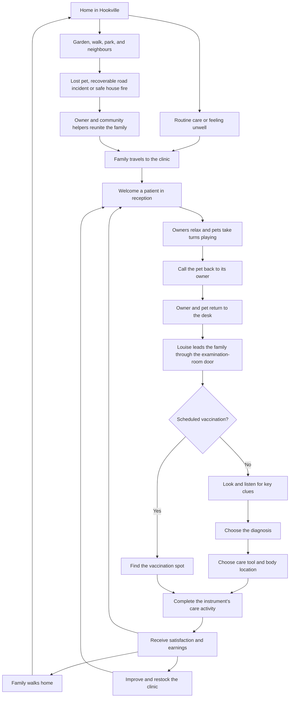

# Louise's Vet Office — master game design

## 1. Authority and status

This is the authoritative product design for Louise's Vet Office. It tells one
continuous story, from welcoming a neighbour to improving the clinic. Read it
alongside [AGENTS.md](../AGENTS.md), which requires its maintenance as the game
changes. [README](../README.md) owns operational instructions;
[asset credits](assets.md) owns provenance and licenses.

Version 1 is a working first playable slice: ten authored visits, six species,
an animated office, interactive 3D examinations, gentle care challenges, rewards,
and a small clinic shop. Detailed behavior below describes that slice unless
explicitly labelled otherwise. **Version 2 — Hookville** extends that slice with a shared town/clinic simulation,
routine care, community emergency services, recoverable accidents and house fires, saved journeys, a fever visit with two
new tools, a visible clue summary, and a modular clinic with active waiting-room entertainment; feature status distinguishes
working additions from remaining scope. Current tuning values are adjustable choices,
not permanent constraints.

| Status             | Meaning                                                                    |
| ------------------ | -------------------------------------------------------------------------- |
| Implemented        | Playable within the stated scope, with source and verification references. |
| Partial            | Part of the intended experience works; the remaining boundary is explicit. |
| Approved / planned | Requested product direction not yet playable in the stated scope.          |
| Exploratory        | A possible extension, with no commitment or settled design.                |

Explicit new user direction can revise this design. Code and tests establish
what currently works; they do not silently override product intent. Reconcile
any disagreement in the affected section and feature status in the same change.

### Contents

- [2. Vision and design pillars](#2-vision-and-design-pillars)
- [3. Setting, spaces, and cast](#3-setting-spaces-and-cast)
- [4. The visit loop and its stages](#4-the-visit-loop-and-its-stages)
- [5. Examination and care mechanics](#5-examination-and-care-mechanics)
- [6. Interface, controls, and accessibility](#6-interface-controls-and-accessibility)
- [7. Current case catalogue](#7-current-case-catalogue)
- [8. Economy and clinic progression](#8-economy-and-clinic-progression)
- [9. Art, animation, and sound](#9-art-animation-and-sound)
- [10. Platform, saving, and delivery](#10-platform-saving-and-delivery)
- [11. Feature register and development milestones](#11-feature-register-and-development-milestones)
- [12. Experience acceptance criteria](#12-experience-acceptance-criteria)
- [13. Open decisions and decision history](#13-open-decisions-and-decision-history)
- [14. Implementation and verification map](#14-implementation-and-verification-map)

## 2. Vision and design pillars

Louise runs a welcoming veterinarian office in **Hookville**, a Sims-style town.
In v2, the clinic participates in the daily life of named households: their walks,
friendships, routine care, and occasional small mishaps create reasons to visit. An owner arrives with
a much-loved animal and a small worry. Louise listens, looks closely, works out
what will help, and gives gentle care. The animal leaves happier, the owner feels
reassured, and the earnings make the next visit a little more comfortable.

The game is made for Louise and suitable for ages 7 and up. The pleasure comes
from noticing a clue, understanding it, and using a tool skilfully. Running the
office gives those caring moments a continuing purpose.

1. **Care comes first.** Pets and people are sympathetic characters. Mistakes
   invite another try; there is no blood, animal death, or punishment for reading
   slowly. Scores acknowledge care quality without making failure frightening.
2. **See and do.** Inspect the actual 3D animal and anatomy, hear the heartbeat,
   and place tools deliberately. Notes reinforce observations the player can
   perceive. Tool-specific care activities add spreading, wrapping, strokes, aiming, grip control, steady placement, pressure and pouring.
3. **A clinic that feels alive.** Neighbours approach Louise face to face, people
   and animals walk and idle, and purchases make the office visibly welcoming.
4. **Grow through good care.** Satisfaction and money are the two score tracks.
   Income supports stock, furnishings, equipment, advertising, and more space.
5. **Easy to read, forgiving to control.** Large rounded lettering, visible next
   actions, helpful targeting, and touch/keyboard alternatives support children.

This is fictional storybook care, not veterinary training. Anatomy is simplified;
heart rates use species-appropriate physiology with representative readings as
defined in section 5. Do not introduce real dosages or instructions for treating
real animals. V2 permits occasional non-graphic accidents affecting cats or dogs, capped
at a recoverable broken bone, and house fires followed by gentle smoke/skin checks.
Every fire is extinguished and every pet recovers. There are no deaths, blood,
severe injuries, permanent property damage, or escalating crises. Emergencies
must not reward causing harm or punish slow reading.

## 3. Setting, spaces, and cast

### Reception: the 2.5D home view

The isometric office is the player's home between visits. Louise stands behind
the counter at the top/back of the scene and faces arriving customers. Owners
enter from the side doorway and walk up toward the desk. Arrival paths must not
bring customers in behind Louise or turn her away from them.

When a family arrives with another pet along for company, that pet follows the
owner's path through the street and examination-room doorways. It waits near the
owner and idles when they stop, rather than waiting outside or walking against a
wall. Only the selected patient receives care and uses patient amusement queues;
an accompanying pet does not create another appointment or fee unless it is also
a rescued patient needing its own post-fire care. Those families stay for each
pet’s appointment before heading home together.

Each dog and cat has a stable breed model and coat: golden retriever, wire-haired
terrier, chestnut spaniel, border collie; silver British shorthair, ginger Maine Coon, tuxedo shorthair,
and Siamese. Pico is Ruby's blue budgie, Pepper is Lily's grey cockatiel, and Melody
is Theo's golden canary. These three birds share their owners' existing homes.
Names, household IDs, and existing saved appointments remain stable. The same
breed model appears in the garden, on the journey, in the office, and during care.
Healthy birds fly alongside their owners and make short flights around their home perches. In the clinic they fly between suitable activities, drink at the water dispenser, circle the aviary and land in the friendly play tree. Fever patients rest instead. Birds never join mammal rides or road accidents.

The waiting list shows each pet's name, appearance/breed, and presenting concern.
The player can call the next patient or choose another waiting patient. Existing
customers retain their places when someone new arrives. A treat shelf, plants,
seating, equipment, advertising, and adjoining room modules give purchases a visible home.
Current room and furniture positions are authored; there is no free-placement editor.

### Examination room

An examination room is included behind reception from the beginning. An opening
mint door connects it to the office. Its cutaway walls reveal the examination
table and mat, sink, stocked cabinet, towels, and care sign. **Exam room** focuses
the room without calling a patient. The room is part of the same clinic footprint
in Hookville; the close-up care scene reuses its room and table models. The
foreground door leaf is cut away during close-up care so it cannot hide the pet.

### Growing the clinic and spending time together

The shop adds a **customer lounge**, then an adjoining **pet playground**. Both
are real rooms connected to reception by a central aisle and open doorways, and
are part of the same building in Hookville. Low cutaway partitions keep occupants
and attractions visible. Capacity grows from four to six to eight patients,
including the animal being examined. Room buttons beneath the scene let the
player watch reception, the examination room, either purchased room, or the whole clinic.

Arriving owners first walk to the counter and pause briefly to check in, then
walk to a free waiting seat or game-table place. They keep that place for the
visit, sitting, reading, or playing there until the player calls them. They do
not make timed trips back to the desk or randomly change chairs. If every seat
is occupied, an owner waits in a designated spot in the waiting area and takes
a seat when one becomes free. The original bench is usable without a purchase. Extra seating adds two
places; the lounge includes three chairs. A book trolley enables seated reading
with a held book; a lounge board-game table adds two usable game seats with hand
animation. A place is reserved while its owner approaches, so two people cannot
occupy one chair. Lounge chairs face into the room. Owners approach the open side of their seat; pets rest in front of the seating, clear of backs and legs. Routes to the new garden go around the game table. These are ambient activities, with no patience countdown.

The playground is a contained pet amusement garden with visible queue markers.
Its six-by-fourteen-unit footprint grows behind the clinic, with the outer front
corner pulled inward to leave Willow Crescent's pavement and road clear. Buying
the playground includes all this space; existing owners receive the larger layout
without another charge. A clear side aisle serves the larger rides. Its
included toy corner suits dogs, cats and rabbits. Purchased scratching posts suit
cats, exercise wheels suit hamsters and gerbils, and the gentle merry-go-round
suits dogs and rabbits. The **Pet rollercoaster** takes dogs, cats and rabbits on
a low oval with one gentle hill in a snug car. The **Pet Ferris wheel** carries
the same species in a level cabin for one slow revolution. Eligible pets leave their owners, walk to an available
line, wait in arrival order, take a turn, and return for a rest. Each attraction
admits one pet at a time and at most three pets travelling to or waiting in line;
other pets wait beside their owners until space opens. Cats rear and paw at the
post, rodents run inside the turning wheel, and carousel riders travel with the
platform. Coaster riders follow the car around the track and over its hill; Ferris wheel cabins remain upright as the rim turns, with one occupied cabin per turn. Toy play uses animated paw movements. Broken-bone and fever patients
rest beside their owners; goldfish stay in their bowls and do not use rides.

Turns last 7 seconds at the post, 8 at the exercise wheel/carousel, 12 at the rollercoaster/Ferris wheel, and 6 at the toy corner,
followed by a 7-second rest. Arrival check-in pauses for 1.5 seconds; seated
owners have no movement timer. These are current ambient tuning values, not player
deadlines. Attractions do not charge fares or repeatedly grant coins/satisfaction;
they make reinvestment visible while the core reward still comes from care.

In the office, hover a visible person, animal or attraction, or tap it on a
phone, to see a small bubble above its head or model. It follows the selected
object as it moves and shows the name, owner/species or role, and current feeling.
People include Louise and all visiting owners; pets include accompanying animals.
All pet attractions, books and customer game tables have names. The patient and
activity lists stay visible and usable throughout. Selecting another object
immediately replaces the previous bubble. A bubble lasts five seconds; hovering
motionless does not restart it. Move off and back, or tap again, to read another.

Pets and owners also speak automatically during their actual activities. Coaster
riders say “Wheee!”, cats enjoy a scratch or a cosy rest, and pets at the treat
dispenser describe species-appropriate food: doggy treats, kitty nibbles, greens,
grains or cheek-pouch snacks. Bird-seed and fish-flake wording is defined for
those species, but does not create a feeding action where none exists. Queueing,
boarding, returning and resting each have their own context. An accompanying
pet describes its own state, never the patient's attraction turn.

Each of the 24 named pets and 18 owners has an individual voice, with at least
five distinct complete messages for every action/feeling. Louise also has a voice.
Messages combine a contextual action line with one of five character-specific
expressions; gentle expressions replace cheerful ones during discomfort, rain,
lost-pet searches and rescues. Variants cycle per character and action without
repeating until all five have been used. These small fictional thoughts are
atmosphere, not clinical advice, personality scores or preferences.

Only one information/reaction bubble appears at a time across the visible scene.
Hover/tap inspection takes priority. Automatic messages last five seconds with a
two-second quiet gap, choose visible actors with rescue/weather/street-stop
messages ahead of ordinary routines, and share turns among eligible speakers.
The same unchanged action does not repeatedly reopen its bubble. A finished
activity closes its automatic reaction; an inspected character's feeling updates
without extending the original five-second lifetime. In busy scenes not every
short phase will be spoken. No backlog delivers an old reaction after an event.

Hookville uses the same bubbles for owners and pets throughout walks, gathering,
garden/kennel rest, neighbour chats, park activities and bench conversations,
clinic journeys/queues/returns, rain shelter, dog sniffing/toilet breaks and owner
cleanup. Every lost-pet, police search, tree/ladder rescue, driver/road response,
house-fire rescue and reunion phase has contextual pet and owner lines. Uninvolved
companions do not claim to be rescued, and hidden animals inside houses do not
reveal themselves through a roof. These bubbles replace the old always-on “...”
and sleep sprites. Helpers' existing station labels and town identity controls
remain available; custom helper dialogue is outside this feature.

Bubbles never call a patient, interrupt a ride, affect scores or change routes.
Their selection, cooldown and message-cycle positions are session-only, with no
save migration or offline catch-up. Dialogs/background tabs pause the town as
before; expired bubbles disappear when play resumes. Vaccinations, Stop visit,
examination reading and rewards retain their established rules.

The **Play garden extension** adds a six-by-eight-unit garden behind the lounge,
beside the original playground. Buy it in **Clinic shop** after Pet playground,
then use **Play garden** below the scene to view it on desktop or touch. Its six
fixed spaces take these separately purchased activities:

- **Treat dispenser:** dogs, cats, rabbits, hamsters and gerbils press a paw pad
  and enjoy a storybook snack; a visible dispenser releases little treats.
- **Water dispenser:** those pets and birds take a drinking break at a bubbling bowl.
- **Bouncy toy box:** dogs, rabbits and rodents chase a rolling ball and hop.
- **Yarn-ball corner:** cats bat and chase yarn on a soft mat.
- **Bird aviary:** birds flap their wings and fly a circuit inside a roomy open-front
  pavilion, with branches and a gently moving swing.
- **Friendly play tree:** cats climb spiral landings and birds fly to its top
  perch, linger, then descend. Cats and birds share it peacefully, taking turns;
  there is no hunting or fighting.

The existing one-user, three-waiter queues apply. Dispenser turns last 7 seconds,
new toy turns 8, and aviary/tree turns 12, followed by the usual 7-second rest.
Calling a flying or climbing pet lets it finish its turn at ground level before
returning to its owner. Cancel call releases it back to waiting; Stop visit and
vaccination care retain their existing flows. Purchases, queue order, positions,
and active turn progress save normally. Older saves need no new purchases and
receive the lounge seating correction automatically.

The extension adds activity space without increasing the eight-patient capacity.
Items build automatically in their reserved spaces; there is no free-placement
editor. Dispenser refills are included and do not consume retail treat stock.
These are free waiting activities with no additional fees, recurring rewards,
feeding deadlines or medical effects. The full garden stays inside clinic grounds,
clear of the pavement and street.

The **Sunshine courtyard** adds another six-by-eight-unit wing behind the
playground, available after Pet playground. Its doorway joins the playground’s
clear side aisle. It is an outdoor lawn with soft grass texture, cream pointed
pickets in Hookville’s garden palette, and stepping stones along the open aisle.
The fence surrounds the purchased plot and leaves the existing 1.9-unit entrance
clear; it has no tiled floor or low room walls. **Courtyard** and **Whole clinic**
camera jumps include the new space. It stays clear of pavements, roads and neighbouring houses, and leaves
patient capacity at eight. Fixed spaces support a two-seat **Puzzle picnic table**
for customers and three pet diversions:

- **Bubble chase:** dogs, cats and rabbits hop after moving soap bubbles for nine seconds.
- **Cosy cat nook:** cats settle into a soft hooded bed with breathing for ten seconds; the shared bubble system can show a short sleepy thought.
- **Bird chime arch:** birds flap up to a perch, play beside swaying chimes, then fly down during a twelve-second turn.

The existing single-pet turns, three-place queues, seven-second rests and health
restrictions apply. A called bird finishes its descent before returning for care.
The puzzle table uses reserved seats and visible seated game gestures; customers
stay there until called. A separately purchased flower border dresses the new
courtyard. Pawprint bunting, a cosy welcome rug and a three-picture happy-pets
gallery decorate reception without needing the courtyard. These purchases have
visible effects, with no additional care bonuses, recurring fees or rewards.
Purchases and ongoing activities save; existing owners keep all earlier upgrades.

### Examination room: the close-up 3D view

Selecting a patient changes to a full 3D examination-table view. The player can
rotate around the animal and bring tools to its body. Owner story, care notes,
tools, and the next action surround the scene without hiding the patient or
requiring a search for the diagnosis button. Goldfish stay in their travel bowl.

### Louise, neighbours, and pets

Louise is the named vet and welcoming face of the clinic. Her approved portrait
and Blender character use the family reference for a recognisable, gentle
storybook appearance. Provenance belongs in [asset credits](assets.md); the
reference photograph is not a repository or shipped asset.

Customers include women and men, currently represented by three animated models.
Named owners keep a consistent appearance across visits. Seven pet species are modelled: dogs, cats, rabbits, hamsters, gerbils, goldfish and birds. Individual names and stories come from the case catalogue; dogs, cats and birds have the distinct breed models described in the roster.

### Hookville: the v2 town view

**Approved v2 scope:** exit reception into a browsable 3D town and return through
Louise's clinic. Named customers share persistent household identities with the
patient roster. Every customer has a house or flat. Hovering a home shows its
owner and pets, such as **Amelia, Luna and Scout's House**; tapping and a keyboard
household directory provide the same information.

Houses have gardens where dogs and cats roam. Dog households have visible
kennels, with dogs occasionally sleeping there. Owners emerge on varied rhythms,
gather their pets, walk along pavements and crossings, visit the park, and return
home. Neighbours meeting on foot pause to chat with personal speech bubbles and
then resume their destination. Small pets and fish are not forced into dog walks.
Families spend 8–20 active seconds at home between outings. Passing neighbours
can chat within two town units for four seconds, then wait fourteen seconds
before another conversation. These short rests and varied departure times keep
people circulating while leaving time to enjoy the park and watch each activity.
Traffic circulates on roads; crossing behavior and vehicle movement must read
clearly rather than pedestrians cutting through houses.

**Hookville Pet Park** is a dry, landscaped space beside the eastern crossing,
with a rounded pond, stone edging, reeds, a gentle bubbler and four swimming ducks
(two adults and two ducklings). The **Pet park** button focuses it from the town
view on desktop or touch; normal pan, zoom and Back to the clinic remain visible. On narrow phones, map controls use two rows and home labels sit above them.
The park is free to visit, has no shop prerequisite, fees or patience penalties,
and adds no treatment, score or currency requirement.

Nine two-person benches provide eighteen distinct family seats. Owners walk in
from the existing pavement, approach their bench from the front, sit, and chat
with the neighbour sharing that bench using hand gestures and personal speech bubbles.
Pets have separate resting places near their owner. A shared station reserves
one pet at a time; other pets rest beside their family until a suitable station
is free. Dogs retrieve a ball and run through an agility hoop; cats scratch and
climb at a log or pounce in a butterfly garden; rabbits hop and use the tunnel
run; hamsters and gerbils use its open hoops and low enclosure; birds flutter at
a toy perch. Fish swim in their own bowls beside the resting family and watch
the water. They are never released into the duck pond. Pets alternate between their available activities across turns, with nine-second play turns and a rest between them.

Park stays are currently 35–55 active seconds depending on the family and its
schedule, plus time to gather companions and walk out. Activities stop accepting
new turns when a family is leaving. Pets return to their own family, then the
owner walks to the entrance with them before taking the pavement home. An invited
clinic visit recalls the family in the same way before its journey to Louise.
Park presence, routes, pet positions, reservations, turn counts and gathering
state save across reload; older saves without park state allocate the family's
seat on arrival. Switching between office and town keeps the park running;
existing dialogs, care activities and hidden tabs retain their
usual pause rules. Vaccination, Stop visit and clinical rewards are unchanged.

The town and clinic share **town event → owner gathers pet → journey to clinic →
queued visit → care → journey home**. The first three authored patients are already in their waiting places when a
new clinic opens. Further authored introductory visits
are invited from their current homes or walks, followed by healthy introductory
checkups for the ten new pets; after that introduction, household
schedules generate vaccinations, healthy checkups, and occasional fevers.

**Eighteen named customers and twenty-four pets live at sixteen distinct addresses.**
Four buildings are flats; Mia/Clover and Zara/Waffles share one, and Theo/Coral
and Max/Ziggy share another. Each family retains its own schedule, pets, visits,
and return destination. Hovering or tapping a shared flat opens Home info with both
families available; the map caption names the selected family. The directory and
**Follow [owner]** controls locate individual people.
Hover a visible person or animal, or tap them on a touch screen, to show their
identity in the fixed caption beneath the town view. Residents show their name
and pets; pets show their name, owner and species. Louise, police, firefighters,
drivers and pond ducks have appropriate name or role labels. Hidden actors are
not selectable through walls; dragging the map does not count as tapping an
actor. Names stay readable while watching or after tapping and clear when the
pointer leaves or the camera is panned. Home labels and the household directory
remain available.

The four keyboard arrow keys and on-screen arrows pan left, right, up and down
relative to the current camera orientation. Repeated key presses continue the
pan, prevent browser scrolling and stop automatic following. Keyboard panning is
active in Hookville and reception, outside dialogs and text-entry controls.
Mouse orbit, touch gestures, zoom and the fixed clinic-return button remain available.
Reception uses smaller pan steps suited to moving between rooms.

Every exterior has a distinct combination of dimensions, roof form, porch/bay,
chimney/dormer/balcony, shutters, planters, and colour. Interiors of homes are
not browsable.

High Street connects **Willow Crescent** and **Orchard Lane**, two winding roads
that form northern and southern neighbourhood loops. Outer homes face the
curved roads, with garden paths connected to their pavements. The park, pond,
benches and planted greens sit among the residential streets. Pedestrians use a
connected pavement graph and marked crossings; cars follow continuous road
circuits round the bends, turn at junctions and yield to pedestrians. The four
ordinary traffic slots now use a coral compact hatchback, blue estate, mint pickup
and plum delivery van, with distinct Blender bodies, windows, lights, bumpers and
wheel hubs. The pickup has an open bed; the estate has roof rails; the van has a
tall parcel compartment. Each slot keeps its model and colour through stops,
rescues, camera changes and reloads, including existing saves. Wheels roll with
travel distance and stop when the vehicle waits. This is ambient variety with
no purchase or player control, and uses the existing routes, crossing rules and
safe driver-response stories.
The shared layout defines both Blender scenery and navigation so paths cannot
drift away from their rendered roads. Pavements use continuous strips with
shared corner edges and filled branch junctions, keeping bends free of gaps.

The simulation and town models start with the game. Owners have varied garden/gather/walk/park/chat/home routines.
All household pets can accompany park outings. Cats and dogs walk; smaller pets travel with their owner, and fish stay in their travel bowls. Companion pets remain with the family through the clinic and the journey home. No owner can have two active visits or appear
twice. Reception is a cutaway of the actual clinic building in the town,
viewed through a closer camera. It uses the same resident and pet scene objects
and world positions as the street view. Families walk from the pavement through
the side doorway into a free waiting place; the queue becomes available at
admission. Arriving families reserve separate pavement places beside the clinic,
with room for their accompanying cats and dogs. One family at a time walks from
its place to reception and checks in; departing families clear the doorway first. After care, they walk from their indoor position back through that
same doorway, along the pavements, and into their own garden. Switching cameras
never recreates or restarts these walks. Louise leads the owner and patient from the desk through the examination-room
door. The owner waits beside the table during care; the close-up camera uses a
matching room and table scene.
The result pauses departure until the player closes it. **Follow [owner]** can
track a departing family even while it is still walking out of the clinic.
Dragging/panning the town, choosing a home or resetting the camera ends following.

### Street furniture and everyday dog walks

Seventeen curved lampposts and six red fire hydrants furnish the three roads,
clear of traffic and the expanded clinic. Dogs on ordinary outdoor walks can
pause beside a nearby post or hydrant, lower their heads and sniff. Scout, Teddy
and Waffles are male dogs and sometimes lift a hind leg for a brief wee; Luna,
Hazel, Maple and Daisy are female and sniff without that behavior. This identity
belongs to the named pet and remains consistent across visits and reloads.

Every dog on a substantial outing gets a poo stop: after the family has walked
twelve town units (about seven seconds of uninterrupted walking), each accompanying
dog that has not yet had a poo stops at the next safe pavement spot. Sniffing or
wee cooldowns cannot prevent this stop, and two-dog families take turns. Actual
walking distance counts; waiting, chatting, park activities and cleanup detours
do not. Progress spans the outward and homeward legs, survives reload, and resets
once the family is home. Shorter walks can also get a random toilet stop.
The dog squats; its owner waits, approaches with a
mint cleanup bag, bends to pick it up, and returns to the walking route with the
dog. The small pile disappears into the cleanup; no litter or stains accumulate.
A family finishes its stop before walking on, chatting or accepting a clinic
invitation. Stops reserve space so families do not crowd the same fixture.
These events happen only on ordinary Hookville walks, off roads and clinic
grounds; they never happen inside the clinic, during a rescue or on a care journey.

The player can watch using the existing town camera and **Follow [owner]** on
desktop or touch. The household status describes sniffing, a toilet break or
picking up. Owners handle everything automatically; there is no cleanup tool,
shop requirement, reward, penalty or toileting deadline. Vaccination, Stop visit,
and unhurried care retain their existing flows and pause rules.

Current tuning gives a passing street fixture a higher chance of inviting a
random stop than an ordinary pavement stretch (1.1 versus 0.07 opportunities per
active second while eligible). Thirty percent of random fixture stops are poos;
other stops are sniffing or, for male dogs, sometimes wees. Initial random
opportunities unlock after 15 seconds plus three seconds per household ID.
Sniffing lasts about 1.7 seconds, a toilet pose 2.4 seconds and pickup 1.4 seconds, plus approach/return walking.
Each family waits 45–90 active seconds after a completed stop before another
random opportunity; a dog still owed its first poo bypasses that cooldown.
These are ambient rhythms, not player timers. Lamps have warm bulbs
within the existing daylight scene; a night cycle is not part of this feature.

### Sunshine, showers and shelter

Hookville usually has sunshine. After an initial 75 active seconds of sun, short
18–26-second showers alternate with 120–200-second sunny spells. The town title
shows the current weather. Rain streaks, cooler softer daylight and darker,
glossier paving make showers visible; ground surfaces dry gradually afterwards.
Rain effects belong to the town camera so the clinic and examination remain
clear and readable. Weather shares the town’s active-time clock: dialogs, care
activities, results and background tabs pause it, with no offline catch-up.

A walking cat near a reachable tree has an 85% chance per shower of sheltering.
The cat hurries ahead and the owner follows to a separate place under the canopy;
other family pets stay with the owner. Families reserve different trees, wait
until the rain stops, return to their original pavement positions, and continue
the same walk. Trees must be within twelve world units with a clear off-road
approach. A family without a reachable free tree keeps walking and can try when
it gets nearer one. Cats already attending the clinic, involved in a rescue or
sharing a dog’s current street stop are not interrupted. Sheltering is a harmless
ambient pause, with no illness, money effect, penalty or player deadline.
Vaccinations, Stop visit and ordinary care retain their established flows.

### Community helpers, lost pets, and safe rescues

A **Fire & Rescue station** on the east side and **Hookville Police** on the west
side serve the same streets as the residents. **Town news → Fire station / Police
station** focuses either building; **Watch rescue** follows the current story,
including the travelling engine or searching officer. These buttons work with
mouse, keyboard and touch. Dragging the map or choosing another destination ends
following. Back to the clinic always remains visible. There is no purchase,
unlock, alarm-management task or player button for causing an emergency.

One coordinated emergency runs at a time. The first opportunity is after 35
active seconds; later opportunities are 100–160 seconds after the previous
story started, with at least 20 quiet seconds after responders finish returning.
An eligible household must be home. A roadside response takes priority; once
that response finishes, its patient's clinic visit does not block another
household's story. Selection chooses only eligible households: when both kinds
are possible, 30% are house fires and otherwise a wandering dog, cat or bird.
If only one kind is possible it is used; if nobody is eligible the scheduler
waits for a household to get home. These are quiet intervals between opportunities, not deadlines.
Responders handle events automatically while Louise continues caring for patients.
The town’s existing pause rules apply; reading a care activity never makes a
rescue worse. The current phase appears in Around Hookville.

- **Lost pets:** the pet bolts from its garden and its owner visibly chases it
  along the connected paths. During this escape, dogs and cats move at 4.2 town
  units per active second and birds fly at 4.8, ahead of the owner at 2.8. After
  at least 4–8 seconds and a gap of more than twelve town units, the owner gives
  up the chase and walks to the police station. The gap measures distance from
  the moving owner, not the house; building occlusion is not simulated. A ground
  pet reaching a nearby destination continues toward a distant tree so short
  routes do not become endless circles. An owner who reaches a perched bird, or
  whose cat has already climbed a tree, seeks help even without the full gap.
  The escape boost ends when the owner leaves for help: unchased ground pets
  return to 1.8, dog-chased cats to 3.2 and birds to 3.2 town units per second.
  A police officer walks out and leads the owner
  toward the pet. An unchased ground pet within six town units of the officer
  waits when called, once it is off the road. Its waiting position persists
  across reloads; the officer closes the distance and the owner walks up before
  handover. A nearby cat can be collected immediately without an artificial
  three-minute chase. Cats already chased toward a tree finish that tree rescue;
  birds keep their flight/perch and ladder sequence. They reunite on foot if no
  ladder is needed.
- **Cats:** a wandering cat can meet an available household dog, which visibly
  chases it to the nearest public rescue tree. The cat climbs and waits. A chase
  can leave a scratched paw, or contact with a car can cause a recoverable
  fracture. A cat that waits in a tree may jump down and need fracture care;
  once a firefighter starts climbing, the rescue finishes safely. If no dog is
  available, the police can eventually reunite the owner with the wandering cat.
  The chasing dog returns to its own garden after the reunion.
- **Birds:** a runaway flies between public trees with its authored flapping
  animation, resting briefly on each. After at most two active minutes of flights
  it stays at its last tree. The officer locates it at a tree and requests a
  ladder. Birds are never road-collision patients.
- **Dogs and road incidents:** lost dogs wander on the connected paths. Actual
  car contact with a dog or cat can produce a fracture. Ordinary eastern-crossing
  incidents use the same driver response. The car stops; its driver gets out,
  walks to summon the owner, and waits while the owner collects the patient.
  Only after collection does the driver walk back and continue driving. The
  owner carries the same injured pet to Louise for X-ray/heartbeat checks and
  a support wrap. No graphic impact or injury effect is shown.
- **Tree rescue:** the engine follows connected roads with flashing blue beacons
  and an alternating siren when sound is enabled and the town is visible. Nearby
  traffic yields. It parks on the road near the tree; a firefighter gets out,
  walks over with the ladder, sets it up, climbs, collects the pet, descends
  carrying it and walks to the owner for handover. The officer walks home and
  the firefighter boards the engine before it returns to its station. The
  rescued bird needs a sore-wing check and cooling care; a cat needs paw care
  unless it has a fracture.
- **House fire:** animated orange/yellow flames and rising smoke surround one
  occupied home. All its resident families wait safely outside, including both
  households of a shared flat. The engine arrives; a second firefighter works
  the visible water stream while the rescue firefighter approaches. The fire
  diminishes over eighteen active seconds of spraying and is completely out before the
  firefighter checks inside. The firefighter makes a visible trip inside and
  back out for **every resident pet**, carrying each to safety. Owners receive
  their animals and go to Louise. Walls, roof, garden and home identity remain
  intact; there is no repair cost or permanent damage. Home interiors remain
  unbrowsable, so the interior portion of a rescue is hidden by the exterior.

A rescue handover creates real clinic appointments without consuming an
introductory visit. If several pets from one family need post-fire care, one
appointment is active at a time: completing one returns the family from the
examination room to the waiting queue for the next pet. Each pet earns the usual
care reward once; the family leaves together after the last appointment. Stopping
an examination preserves that patient and its siblings’ pending care. Routine
vaccination still uses its direct placement/pressure activity and is unaffected.
There is no rescue bonus, emergency fare, or penalty for watching instead of
intervening. Storybook smoke and minor skin injuries use the cases in section 7.

Appointments are limited by clinic capacity so other households remain free to
go about their day. If a rescued or accident family reaches a full clinic, it waits safely
outside in its own family place and enters in arrival order when a space opens.
These places leave the entrance, crossings and street furniture clear; clinic
journeys use the pavement beside the waiting families. There is no deterioration,
waiting fee or urgency penalty. **Around Hookville** records recent events; **Find [owner]** focuses a
family's current location or enters the clinic if they are already inside.

Town time advances only during active play. Rendering delays up to five seconds are processed
in small simulation steps so a busy clinic does not stretch walks indefinitely.
A long interruption catches up at most half a second; there is no offline town
progress. Companion paths are recorded at each step to preserve doorway turns. Background tabs, dialogs, results,
and care activities pause it; ordinary examination and town browsing
continue it. Switching views does not reset routines. Household schedules,
companions, traffic, queued visits, journeys, and the active incident save along
with clinic progress. Reloading requeues an unfinished examination for a fresh
attempt; it never repeats a completed reward.

## 4. The visit loop and its stages

V2 adds **home → town activity → reason for care → clinic → home** around the
existing visit loop. Shared visit records connect that wider loop to the examination room. Two treatment routes share
reception, care, and rewards:

| Stage            | Player action and feedback                                       | Exit and consequence                                                                                                             |
| ---------------- | ---------------------------------------------------------------- | -------------------------------------------------------------------------------------------------------------------------------- |
| Welcome          | Read the concern; select a waiting pet.                          | Playing pets return to their owner, who brings them to the desk. Louise leads them into the examination room before care starts. |
| Investigate      | Use diagnostic tools, inspect anatomy, and collect observations. | Both authored key clues enable **Choose a diagnosis**; other notes remain useful but do not unlock it.                           |
| Diagnose         | Match the findings to an offered answer.                         | Correct answer reveals care plan; wrong answer gives guidance and allows retry.                                                  |
| Place care       | Choose the care tool and body spot in the plan.                  | Correct placement opens the tool’s care activity; incorrect choice explains what to try.                                         |
| Give gentle care | Complete the tool’s movement and choose Finish care.             | A miss leaves care unapplied and allows retry; Finish care confirms success.                                                     |
| Celebrate        | Read satisfaction, fee, tip, any treat sale, and aftercare.      | Rewards save once; return to reception.                                                                                          |
| Improve          | Spend available coins on stock or upgrades.                      | Purchases save and affect subsequent visits.                                                                                     |

Selecting a playing pet reserves that call and releases its ride or queue place.
A rollercoaster or Ferris wheel rider first finishes the current lap and unloads at the boarding station; other attractions release immediately. The owner waits for the pet to return; the interface reports that it is coming
back. **Cancel call** resumes ordinary waiting, and choosing a different patient
cancels the previous call. There is no reward or penalty for either action. The
owner then walks with the pet to Louise’s counter. Louise walks around the end
of the counter to meet them, then leads them through the opening door. Reception
stays visible during this walk, with a short status message and **Cancel call**.
The main patient-call button disappears immediately when either a patient card
or that button starts a call. It stays hidden throughout collection and escort,
then returns if the call is cancelled or the player returns from the visit.
Examination starts automatically only once Louise and the family have reached
the table, while reception is open. Only one family can be escorted at a time.
Cancelled calls, stopped visits, and reloading during the escort return the
family to ordinary waiting. Louise walks back behind reception. After care,
families leave through the examination door, shared aisle, and street doorway.
These walks use the same world positions across clinic and Hookville views. Other pets accompanying the owner follow the same doorways and wait nearby.

Scheduled vaccination has its own entry stage: read the placement clue, find the
soft upper-body coat spot, and control the vaccine-pressure activity. No investigation,
clue collection, or diagnosis is required. The fiction is administering a gentle
vaccine without hurting the pet; a miss gives no vaccine and no injury.

**Stop visit** is available throughout an unfinished visit, including care activities. It
cancels the attempt, returns the pet to the front of the queue, and awards no
coins or satisfaction. Starting that visit again clears its clues and mistakes.
Previous completed progress is retained. There is no visit deadline and no
queue-abandonment penalty.

Healthy checkups collect two normal findings and finish through **Finish healthy
checkup**, with a fee and satisfaction but no invented diagnosis or unnecessary
treatment. On entry, a two-item **Standard checks** list names each instrument
and its body location. Selecting a listed check equips that tool; the player still
makes contact on the model or uses its labelled guide. Each completed check gains
a Done tick. Dogs, cats, rabbits, hamsters and gerbils have a coat temperature
check and chest heartbeat check; birds use feathers for temperature and chest for
heartbeat. Fish instead need the bowl-water test and magnifier inspection of fins.
These are the game's simplified wellness checks, not a real veterinary checklist.
Routine vaccinations keep their separate placement/pressure route.

Runtime stages are `town`, `reception`, `examine`, `diagnose`, `place-vaccine`, `treat`,
and `result`; the instrument activity is a substage of care. Shop, guide, and the reference care
notebook are supporting views, not additional campaign levels. Each active visit
also has its own fixed notebook for that patient’s observations.

## 5. Examination and care mechanics

### Finding a clue

Selecting a tool puts its 3D instrument in the player's control. Hold and drag
over the animal to inspect it, or use a labelled body guide to place the tool.
Findings appear in care notes after inspection. Actual mesh targets and anatomical
regions must agree, including either visible ear and the animal's paws; the
player must not need to guess an invisible hotspot.

Each sick visit currently has two key findings. Other sensible checks produce
normal observations or suggest a closer look. An inappropriate tool/location
pair explains where the tool works. Surface inspection must not pronounce a
hidden ear or tooth problem healthy. Magnifier and X-ray clues require the
problem to be visible in the viewer; touching an unrelated or obscured region
must not reveal it automatically.

### Diagnostic instruments

| Instrument   | Where and what the player observes                                                                                                                                        |
| ------------ | ------------------------------------------------------------------------------------------------------------------------------------------------------------------------- |
| Magnifier    | Live enlarged coat, skin, paws, and other surfaces; fur fibres, swelling, fleas, tangles, and a protruding splinter distinguish cases.                                    |
| X-ray        | Complete species skeleton from the current angle, with zoom and whole-body overview. Pip's front leg has separated, displaced bone ends.                                  |
| Ear scope    | Ear contact opens a lit 3D canal. Healthy tissue differs from Milo's red, swollen canal and wax.                                                                          |
| Mouth mirror | Mouth contact reveals 3D teeth and gums; healthy teeth, Cleo's tartar, and Poppy's tooth crater are distinct.                                                             |
| Stethoscope  | Chest contact drives a species-appropriate ECG rate, with the same cadence in optional double-beat audio. Fever raises that patient’s rate. Leaving the chest stops both. |
| Water test   | The visible bowl water accepts contact across its volume, with a fictional comfortable/needs-care reading. Magnifier contact still reaches the fish through the water.    |
| Thermometer  | Non-invasive storybook coat contact reveals Comfortable or Fever. No reading off the correct body region.                                                                 |

Pets breathe and idle during ordinary examination; X-ray holds the patient still
so skeleton and body remain aligned.

### Heartbeat physiology

The ECG uses representative awake-patient heart rates appropriate to the animal,
including dog size and the three bird types. A quick healthy hamster or canary
must still read **Steady, normal rhythm**. A fever or an authored worry/pain
finding reads **Faster than usual**, relative to that patient's healthy rate.
Fever alone selects the elevated rate; a simultaneous `heart: fast` flag must not
increase it twice. A later healthy visit returns to the normal value.

Current game readings in beats per minute (BPM):

| Patient type                  | Healthy | Worried / sore | Fever |
| ----------------------------- | ------- | -------------- | ----- |
| Golden retriever              | 90      | 120            | 140   |
| Terrier                       | 110     | 140            | 160   |
| Spaniel / collie / other dog  | 100     | 130            | 150   |
| Cat                           | 180     | 210            | 230   |
| Rabbit                        | 240     | 280            | 300   |
| Hamster                       | 450     | 500            | 540   |
| Gerbil                        | 360     | 410            | 440   |
| Budgie / other small pet bird | 400     | 460            | 500   |
| Cockatiel                     | 300     | 350            | 380   |
| Canary                        | 600     | 680            | 720   |

Healthy selections are grounded in published physiology: Merck's
[resting-rate table](https://www.merckvetmanual.com/multimedia/table/resting-heart-rates)
covers dogs, rabbits and hamsters; its
[cardiovascular overview](https://www.merckvetmanual.com/circulatory-system/cardiovascular-system-introduction/the-cardiovascular-system-in-animals)
describes dog-size differences and higher normal cat rates in a clinic. The
[Pet Rodents reference chapter](https://pmc.ncbi.nlm.nih.gov/articles/PMC7271187/)
lists 360 BPM for gerbils. University of Wisconsin Extension's
[caged-bird health supplement, page 2](https://fyi.extension.wisc.edu/wi4hpublications/files/2015/10/4H369.pdf)
distinguishes budgies, small parrots and canaries; the cockatiel uses the small
parrot category. These values represent awake clinic patients, not sleeping rates.

The worried and fever columns are **plausible game examples inferred from that
physiology**, not published fever reference ranges or diagnostic thresholds.
Merck describes fever, stress and pain as causes of
[sinus tachycardia](https://www.merckvetmanual.com/circulatory-system/heart-disease-conduction-abnormalities-in-dogs-and-cats/heart-disease-conduction-abnormalities-in-dogs-and-cats).
Actual responses vary with the individual, temperature, handling and illness;
there is no assumed universal BPM-per-degree rule or fixed percentage increase.
Small-mammal and bird fever increments are illustrative, not validated
species-specific fever predictions. Heart rate alone never diagnoses fever:
the thermometer finding and both required clues remain necessary. No numerical
body temperatures, dosages or real care procedures are introduced.

The scrolling trace spans 2.5 seconds and its cycles match the displayed BPM.
Subpixel sampling preserves peaks at fast bird rates. On phones the compact ECG,
BPM and sound control dock above the care notebook's maximum height, keeping
them unobscured as clues accumulate. The chest-placement prompt remains in the
reading when contact is lost. The optional audio loops
one short lub-dub pair per cardiac cycle on the audio clock, aligned with the
trace, so slow 3D rendering cannot drop beats. Leaving chest contact, changing
tools, muting, hiding the page or stopping the visit stops the sound; returning
resumes at the current cadence without a backlog. The waveform is a schematic
regular rhythm, not a diagnostic ECG lead or a simulation of species-specific
wave morphology. Goldfish keep water and fin checks: there is no invented
stethoscope ECG or mammalian fever rate for them. Vaccination, retries, reading
pace, rewards and saving are unchanged.

### Applying care

The nine care instruments are soothing cream, ear drops, soft bandage, flea comb,
vaccine, gentle brush, water care, fine forceps, and the v2 cooling pad. Together
with the seven diagnostic instruments (including the thermometer), all sixteen
have Blender-authored models.

Correct tool/body placement opens an instrument-specific **care activity**. A
modal card shows the instructions before **Start when ready**; nothing moves while
the child reads. The 3D patient waits still behind the activity so controls remain
responsive on software graphics. Diagnostic anatomy viewers and live readings
remain unchanged; these activities replace the shared care timing bar.

| Care tool      | Activity and success                                                                                                                                                                   |
| -------------- | -------------------------------------------------------------------------------------------------------------------------------------------------------------------------------------- |
| Soothing cream | Spread an even layer across six patches, by dragging or tapping each one; all patches must be covered.                                                                                 |
| Soft bandage   | Drag a bandage roll along three sloping coils around the paw, through seven numbered markers. Stay on the dotted ribbon; a slip returns to the last marker, keeping finished sections. |
| Flea comb      | Make three outward strokes along the fur, returning the comb between passes; six directional movements lift the fleas.                                                                 |
| Gentle brush   | Make six alternating little strokes. Mouth care cleans three storybook teeth; coat care smooths three tangles.                                                                         |
| Ear drops      | Align the nozzle with each of three successive striped guides, then release one drop at a time. Off-target clicks release nothing.                                                     |
| Fine forceps   | Grip the splinter, then ease to three successive marks, pausing at each for 0.85 active seconds. Pulling past a mark prompts a steadier retry.                                         |
| Cooling pad    | Follow a slowly moving comfort guide with the pad for 4 seconds of accumulated alignment. Losing alignment gradually reduces settling progress.                                        |
| Vaccine        | Tap to begin a gentle pressure increase, then tap Pause vaccine in the striped green target. Early, late or unattended attempts apply no vaccine and cause no injury.                  |
| Water care     | Start and stop a pour into a practice bowl, allowing the final trickle to settle near the fill line. A short pour can resume; overfilling starts a harmless fresh attempt.             |

The blue cooling pad can be dragged directly along its illustrated track with a
mouse or finger after **Start when ready**; the slider below moves the same pad.
All slider activities support dragging, touch, and native keyboard arrow keys;
cream patches are individually focusable buttons. The bandage board supports
mouse or finger dragging with pointer capture, and keyboard arrows move the same
roll in two dimensions along the same ribbon. Clicking the numbers or jumping to
a later coil cannot wrap the paw. The roll and completed ribbon show progress;
lifting, losing focus, or cancelling a pointer pauses at the current position
without a penalty, ready to continue. Slipping off the path costs one mistake
and returns the roll to the preceding marker, rather than undoing all the wraps. Colour
is reinforced by stripes, arrows, numbers, progress text and feedback. The native
dialog keeps focus inside its controls and fits phone, desktop and short landscape
windows. **Cancel care activity** or Escape returns to tool placement; **Stop
visit** requeues the pet without rewards. Both remain in the activity card.

Completing the movement enables **Finish care**. Only that confirmation completes
the visit and awards its single reward; repeat input cannot earn another reward.
Mistakes give friendly guidance and gently reduce quality, never cause injury,
consume medicine or impose deadlines. Cancelling preserves mistakes for the same
visit; stopping or reloading starts that unfinished visit afresh. Progress within
an activity is not saved. Hidden tabs pause active time; losing window focus stops
pressure/pouring input, and vaccine pressure restarts harmlessly from zero.
Aiming and timing guides are slightly tighter, vaccine pressure and water flow
advance a little faster, and cooling requires following a broader moving guide
for longer. Cream, combing and brushing retain their simpler coverage/stroke
controls. The equipment upgrade widens alignment/pressure/fill guides and the
bandage tracing corridor. There is still no time limit for reading or wrapping.
Exact scoring and tolerances belong in section 8.

These are illustrated hand-skill activities tied to correct 3D placement. They do
not deform the animal mesh, physically insert a needle or simulate real veterinary
procedures, dosages or fluids.

### Fever and thermometer — v2

The first v2 increment includes a rendered, non-invasive storybook thermometer. Placing its sensor at the
coat gives an explicit **Comfortable** or **Fever** reading, with no real-world
temperature ranges or dosages. Off-body or wrong-target placement must not reveal
a reading. A fever case pairs that observation with the species-appropriate
elevated heartbeat described above, then a gentle cooling pad and its
steady-alignment activity. Healthy pets must
also return a meaningful normal thermometer result. Thermometer and cooling
care have reproducible Blender models. Maple is the first authored fever visit;
household schedules also create fever visits for named pets under V2-04.

## 6. Interface, controls, and accessibility

- Use locally bundled Nunito, generously sized reading text, rounded forms,
  plain words, and short instructions. Leave time to read and explore.
- Keep a fixed care notebook above the visit action bar on desktop and phones.
  **Key clues** and **Care notes** buttons switch its pages without scrolling the
  browser. Each page scrolls internally and stays within the viewport, regardless
  of the length of the owner story or tool list. New observations open Care notes
  with the latest note first; key findings carry a **Key clue** badge. Switching
  to diagnosis opens Key clues. The controls show clue progress and note count.
  A newly discovered key clue gives the **Key clues** button three gentle pulses
  over 2.4 seconds; repeat observations do not restart the signal. At 2/2 it stays
  green, with a tick and Ready label, regardless of the selected notebook page.
  Reduced-motion settings use a steady outline instead of pulses. Ordinary notes
  do not trigger the key-clue signal; beginning another visit resets it.
- Keep **Stop visit** and **Choose a diagnosis** in the fixed visit action bar.
  Care notes live in the notebook rather than below the tools, so accumulated notes never push the next
  action below the screen. Show clue progress and explain unavailable actions.
- Distinguish tool use from camera movement. **Look around** makes dragging orbit
  the patient; rotation/reset buttons remain available with a tool selected.
  Optical instruments have zoom; X-ray also has a whole-body option.
- Labelled body guides offer keyboard/touch alternatives to precise aiming.
  Controls need meaningful labels, visible focus, and feedback after activation.
  Audio must not be the only way to find a required clue.
- Reception and Hookville fill the available browser viewport, including short desktop windows
  and phones, with Clinic shop, Hookville, My clinic and Care notebook always in
  the bottom navigation. The waiting list shows two readable patient cards per
  page, with Previous/Next buttons; **See [next patient]** remains available.
  **Patients** and **While you wait** switch the sidebar between patients and
  paged ride/owner activity information. Paging requires no browser or panel
  scrolling and does not change the queue, call or simulation. Room buttons stay
  beside the scene, independent of these pages.
  They support touch and keyboard focus. Reception also has free camera movement:
  left-drag or one-finger drag orbits all the way around, right-drag pans, and
  the wheel zooms; two fingers pan and pinch to zoom. Arrow keys and six visible
  pan/zoom buttons provide alternatives using the same controls as Hookville.
  Panning stays on the ground within a circle enclosing the owned clinic rooms
  and examination room, growing with expansions. Tilt and zoom are bounded so
  the camera stays above ground and the clinic remains easy to find. Room buttons
  are quick jumps that reset orientation and zoom; movement remains available
  afterwards. On phones, compact Lounge/Playground/All rooms labels keep every
  jump visible; short screens omit the scene heading to leave controls clear.
  Moving freely clears the selected jump and labels the view **Your clinic**. Sidebar updates and shop dialogs do not reset the camera;
  dialogs suspend keyboard panning. These controls turn off during examination,
  which retains its separate tool/orbit controls.
  A single five-second bubble follows the inspected head/model while the
  patient/activity menu remains visible. It ignores pointer input, so it cannot
  block camera gestures or patient selection. Its tail indicates the target;
  positions stay within the scene, and labels hide while their target is hidden
  or offscreen. On very short phones the bubble can briefly overlap scene
  controls; their positions stay fixed and taps pass through the bubble.
  Text stays crisp at town zoom levels. Escape, camera movement, changing a list
  page/tab, dialogs and view changes dismiss inspection. Drags, including a drag
  back to its origin or a two-finger gesture, never select an object. Empty taps
  dismiss inspection. A tap remembers the original pet even if its ride moves
  before release. A later hover/tap replaces the sole bubble immediately.
  **While you wait** lists active rides,
  queue counts and owner pastimes. Pending calls, Louise’s escort progress, and **Cancel call** appear above the patient queue. The camera widens to show reception and the room during the walk. Reading it never creates
  a penalty or changes the examination's fixed clues and action bar.
- Hookville keeps its map controls, bottom navigation and **Back to the clinic**
  button inside the viewport. **Homes** lists four households per page; **Home info**
  shows the selected family's current status, pets and Follow button. Shared-flat
  resident buttons switch the displayed family without losing the address.
  **Town news** shows one of the latest four updates per page, with Find-owner
  actions. Map selection opens Home info; routine status refreshes preserve the
  chosen tab/page. Desktop, keyboard and touch navigation need no page scrolling.
- On phones, tool selection brings the animal into view; optical controls dock
  below it so a dragging finger does not hit them accidentally. Keep controls
  clear of the patient and bottom action bar.
- Shop purchases preserve the open shop’s internal scroll position and keyboard focus, so buying an item does not jump back to the top on desktop or touch.
- Optional sound starts disabled and the preference saves. The care notebook and
  guide provide reading support; voiced narration is exploratory.

These are experience requirements, not a claim of complete accessibility
certification. Check keyboard and touch paths when interactions change.

## 7. Current case catalogue

Eleven authored introductory visits establish the cast, with three patients
already in the initial queue. Players may choose any waiting patient. Afterwards,
the same residents return for scheduled vaccinations/checkups, fever events, and
recoverable road incidents. These reuse trusted authored care patterns while
retaining pet/owner identity; they are not unrestricted generated diagnoses.

| Pet / owner    | Species  | Problem and key investigation                                                                         | Care in this slice                                   |
| -------------- | -------- | ----------------------------------------------------------------------------------------------------- | ---------------------------------------------------- |
| Luna / Amelia  | Dog      | Bee sting: magnify paw swelling; listen at chest.                                                     | Cream on paw.                                        |
| Milo / Oliver  | Cat      | Ear irritation: scope inflamed ear; listen at chest.                                                  | Drops at ear.                                        |
| Pip / Sophie   | Rabbit   | Fractured front leg, labelled **Sore paw** in choices: X-ray displacement; listen to quick heartbeat. | Support bandage at paw; follow-up in aftercare text. |
| Peanut / Noah  | Hamster  | Fleas: magnify coat specks; listen at chest.                                                          | Comb coat.                                           |
| Sunny / Isla   | Gerbil   | Tangled fur: magnify trapped bedding/tangle; listen at chest.                                         | Brush coat.                                          |
| Bubbles / Leo  | Goldfish | Water needs care: test bowl water; inspect healthy fin.                                               | Water care in bowl.                                  |
| Hazel / Grace  | Dog      | Scheduled vaccination: find upper-body coat spot; no diagnostic clues.                                | Vaccine placement and pressure control.              |
| Cleo / Freddie | Cat      | Teeth need a clean: mirror reveals tartar; listen at chest.                                           | Brush mouth.                                         |
| Scout / Amelia | Dog      | Splinter: magnify wooden fragment in paw; listen to worried heartbeat.                                | Fine forceps at paw.                                 |
| Poppy / Grace  | Cat      | Tooth cavity: mirror reveals crater; listen at chest.                                                 | Gentle cleaning and dental appointment in aftercare. |
| Maple / Isla   | Dog      | Fever: thermometer on coat; listen to quicker heartbeat.                                              | Cooling pad on coat and a quiet rest.                |

Ten further neighbours begin with healthy checkups, then join the same recurring
vaccination/checkup/fever patterns (fish receive checkups). They are Ava/Daisy
(dog), Oscar/Biscuit (cat), Mia/Clover (rabbit), Ethan/Nibbles (hamster), Ruby/Mochi
(cat), Archie/Teddy (dog), Lily/Pebble (gerbil), Theo/Coral (goldfish), Zara/Waffles
(dog), and Max/Ziggy (cat). Three additional bird neighbours (Ruby/Pico, Lily/Pepper, Theo/Melody) begin with
checkups and return for checkups or fever care. Their body guide names **Feathers**,
**Feet**, **Beak**, and **Chest**. Thermometer, stethoscope, magnifier, and X-ray
are available, with matching simplified bird anatomy. Ear scope and dental mirror
are not bird tools; bird vaccinations and species-specific bird diseases remain
outside this slice. A healthy visit uses two normal findings and completes
without a diagnosis choice or unnecessary care.

Rescue visits keep the same named pet, breed and owner:

| Trigger                                 | Checks                                           | Diagnosis and care                                              |
| --------------------------------------- | ------------------------------------------------ | --------------------------------------------------------------- |
| Reunited dog/cat or chase with sore paw | Magnifier on paw; stethoscope on chest           | Scratched paw; soothing cream on paw.                           |
| Tree-rescued bird                       | Magnifier on feathers; stethoscope on chest      | Sore wing patch; cooling pad on feathers.                       |
| Car contact or cat’s jump from a tree   | X-ray on paw; stethoscope on chest               | Broken bone; support bandage on paw.                            |
| House-fire rescue, mammals and birds    | Stethoscope on chest; magnifier on coat/feathers | Smoke irritation and a mild burn; cooling pad on coat/feathers. |
| House-fire rescue, goldfish             | Water tester in bowl; magnifier on fins          | Smoky bowl water; water care in the bowl.                       |

Post-fire care uses a quicker heartbeat and a localized pink skin finding, with
reassuring notes about smoky air and recovery. It is simplified fictional care;
there are no clinical dosages, respiratory procedures or frightening injuries.
Burn/fever/fracture patients rest instead of using playground rides. A recovering
bird rests with its owner on the clinic journey instead of flying.

Routine checkups recur through household schedules; aftercare text is not a
separate calendar booking system. Poppy's cleaning must
never claim to repair the cavity. New cases must keep owner story, visible
problem, key findings, diagnosis choices, care, and aftercare consistent.
Real-world conditions requested for the theme can use gentler wording, as with
ear irritation and Pip's sore paw.

## 8. Economy and clinic progression

### Two score tracks

Satisfaction represents the combined animal/customer outcome; there are not two
separate happiness simulations. The clinic displays an average across completed
visits. Wallet coins can be spent; lifetime earnings remain a separate running
total. There is no rent, debt, or operating-cost countdown in this slice.

**Current tuning:** a new clinic starts with 120 coins, 3 treats, no upgrades,
0 treated pets, and an initial happiness display of 100. Care quality begins at
100; each mistake subtracts 4, and successful vaccine pressure adds `round(abs(pressure − 0.5) × 20)` as a small precision deduction. Other activity types have no additional precision deduction. Quality has a floor of 50. Plants and seating then
add their bonuses to satisfaction, clamped to 50–100.

For a completed visit, the fee is `35 + round(satisfaction × 0.35)` and the tip is
`round(satisfaction × 0.15)`. If stock exists, one treat sells for 9 coins and stock
decreases by one. Their sum increases wallet and lifetime earnings. Displayed
happiness uses the rounded running average, and treated count increases once.
A perfect unbonused visit with stock earns 94 coins. Aborting cannot claim these
rewards. [Game rules](../src/game.ts) and [care skill rules](../src/care-skill.ts) implement
the tuning.

Current care difficulty uses a guide half-width of 0.09 (0.14 with equipment).
Vaccine pressure advances at 0.29 per active second; water pours at 0.28, with
flow decaying by 0.8 per second after stopping. Forceps need 0.85 seconds at each
mark. Cooling follows `0.5 + sin(activeSeconds × 1.05) × 0.28` for four seconds
of accumulated alignment; time outside the guide drains progress at half speed.
Bandage tracing allows a normalized distance of 0.05 from the ribbon (0.07 with
equipment), checks the full stroke between pointer events, and checkpoints each
half-coil. These are game controls, not physical medical measurements.

### Purchases

| Purchase               | Current price | Current effect                                                                                                                              |
| ---------------------- | ------------- | ------------------------------------------------------------------------------------------------------------------------------------------- |
| A little more green    | 60            | Plants; +3 satisfaction per visit.                                                                                                          |
| Treat shelf refill     | 35            | Add six treats; repeatable purchase.                                                                                                        |
| Comfy waiting seats    | 90            | Two usable waiting seats; +4 satisfaction per visit.                                                                                        |
| Steady-paw tool kit    | 150           | Widens alignment, pressure and fill guide half-width from 0.09 to 0.14, and bandage path tolerance from 0.05 to 0.07, on normalized scales. |
| Tell the neighbourhood | 110           | Poster; shortens introductory invitation cadence from 22 to 13 active seconds and future routine-care intervals by the same ratio.          |
| Room for more paws     | 240           | Connected customer lounge with three chairs; increases total patient capacity from four to six, including the pet being examined.           |
| Books and magazines    | 65            | Book trolley and seated reading throughout the clinic.                                                                                      |
| Tabletop games         | 130           | Two-seat board-game table; requires Room for more paws.                                                                                     |
| Pet playground         | 300           | Connected playground with toy corner; capacity six to eight; requires Room for more paws.                                                   |
| Scratching post        | 85            | One cat scratching attraction; requires Pet playground.                                                                                     |
| Exercise wheel         | 110           | One hamster/gerbil running attraction; requires Pet playground.                                                                             |
| Pet rollercoaster      | 260           | One dog/cat/rabbit car on a gentle oval hill track; requires Pet playground.                                                                |
| Pet Ferris wheel       | 220           | One occupied level cabin per slow revolution; requires Pet playground.                                                                      |
| Gentle merry-go-round  | 160           | One gentle dog/rabbit ride; requires Pet playground.                                                                                        |
| Play garden extension  | 300           | Six new activity spaces behind the lounge; requires Pet playground; capacity stays eight.                                                   |
| Treat dispenser        | 80            | Storybook snacks for dogs, cats, rabbits and rodents; requires Play garden extension.                                                       |
| Water dispenser        | 65            | Drinking breaks for mammals and birds; requires Play garden extension.                                                                      |
| Bouncy toy box         | 120           | Moving ball play for dogs, rabbits and rodents; requires Play garden extension.                                                             |
| Yarn-ball corner       | 75            | Rolling yarn for cats; requires Play garden extension.                                                                                      |
| Bird aviary            | 200           | Flying circuit and perches for birds; requires Play garden extension.                                                                       |
| Friendly play tree     | 180           | Peaceful climbing/perching turns for cats and birds; requires Play garden extension.                                                        |
| Sunshine courtyard     | 360           | Connected six-by-eight wing behind the playground; requires Pet playground; capacity stays eight.                                           |
| Puzzle picnic table    | 150           | Two reserved customer game seats with a parasol; requires Sunshine courtyard.                                                               |
| Bubble chase           | 130           | Moving bubble play for dogs, cats and rabbits; requires Sunshine courtyard.                                                                 |
| Cosy cat nook          | 95            | Soft hooded resting bed for cats; requires Sunshine courtyard.                                                                              |
| Bird chime arch        | 115           | Flying, perching and playing beside swaying chimes; requires Sunshine courtyard.                                                            |
| Blooming flower border | 85            | Decorative raised flower planters; requires Sunshine courtyard.                                                                             |
| Pawprint bunting       | 70            | Colourful reception flags; decorative only.                                                                                                 |
| Cosy welcome rug       | 75            | Paw-patterned reception rug; decorative only.                                                                                               |
| Happy pets gallery     | 90            | Three framed pet pictures in reception; decorative only.                                                                                    |

All purchases except stock are one-time upgrades. Insufficient coins or an
already-owned upgrade leaves the wallet unchanged. Missing prerequisite rooms also block a purchase without spending coins; the shop names the required room. Retail currently happens
automatically on visit completion when treats are available.

**Approved / planned extension:** customers should also be able to buy displayed
goods on their way in or out. This broader shopping behavior is not yet modelled.
Stock, furniture, equipment, decoration, advertising, and expansion each have a
small working example. Wider catalogues and deeper clinic customization remain
partial product ambitions, with their scope still to decide.

### Traffic and sense of progress

Households prepare and travel during active visits. Introductory invitations
are spaced about 22 seconds apart (13 with the poster) when capacity allows;
arrival time also includes gathering, walking, and crossing waits. Modals and
results pause town time. Browsing preserves the same records and queue. Waiting does not make owners abandon the queue
or punish the player. Advertising creates opportunities, not a deadline.

The **Help 3 animal friends** goal and **Day** label are treated-count milestones:
the label advances every three completed visits. They are not opening hours,
campaign stages, or timed days. A longer campaign and its unlock sequence remain
exploratory, not an implied next level after buying the annex.

V2 uses current tuning: an initial 100 active seconds before an eligible road
incident, then 180–360 seconds of cooldown plus waiting for an eligible encounter.
After coming home, routine care becomes due in 70–170 active seconds and begins
when that family is at home and capacity allows. The advertising poster also
scales future routine-care intervals by `13 / 22` when a family returns home.
These values can be tuned after
play sessions without changing the caring, unhurried contract.

## 9. Art, animation, and sound

Use warm, softly lit storybook 3D: rounded shapes, friendly faces, pastel clinic
colours, and legible silhouettes. Reception should feel welcoming; examination
should make relevant anatomy easy to see. Modern lighting supports atmosphere
and finding clues without hiding the treatment area.

Hookville’s asphalt has fine aggregate, pavements use repeating slab joints,
grass has soft blade variation, and roofs, wood and plaster have appropriate
surface detail. Original small repeating textures use world-scale UVs so curved
pavements keep continuous texture scale. Subtle bump and roughness complement the
shapes. Car paint uses glossy clearcoat and environment reflections; glazing is
polished. Rain lowers road/pavement roughness and darkens surfaces gradually.
These are lightweight material effects, without simulated puddles or expensive
screen-space reflections. Original Blender shade trees provide roomy canopies;
the new courtyard props retain named moving bubbles and chimes.

Blender authors assets; Three.js renders the browser game. People and pets have
looping `Idle` and `Walk` clips, blended between movement and rest. Walking needs
moving limbs; waiting needs breathing, blinking, head/tail motion where
appropriate. Fish swim while their bowl stays still. Asset edits must preserve
these clips and anatomical targeting. Original `Sit`, `Read`, and `Play` clips
add seated posture, reading/game gestures, and pet paw movement. Held books and
Blender-authored furniture make these activities visible. Wheels and carousel
platforms have separate rotating parts driven by the current pet turn. Coaster cars and level Ferris wheel cabins use the same motion path as their pet, parking at the boarding point when empty; the pet animation and platform motion must agree.

The current assets include the clinic, table, Louise, three customer models, seven
pet species, eleven distinct dog/cat/bird breed exports, species skeletons, abnormal anatomy variants, and all instruments. Live
surface fur and findings complement Blender meshes. Mammal coats use visible, fine, overlapping curved fibre texturing along the
surface, a short soft nap, subtle relief and a warm fabric-like sheen; individual
hairs must not read as needles or obscure a clinical finding. Generated portraits or other
image assets are allowed when they fit the visual direction. Public Creative
Commons audio is allowed with verified licensing and attribution; currently the
game uses original synthesised chimes/heartbeats and has no music recordings.

Louise and the three customer models have rounded cheeks and chins, ears, layered
whites/irises/pupils/catchlights, brows and smiles, plus shaped hands and thumbs.
Louise retains her long brown hair, pink headband and mint coat. Walking combines
opposing arm/leg swings with knee flexion, ankle roll, bent elbows and gentle
shoulder counter-rotation; resting includes breathing, blinking and small head
and posture shifts. Seated, reading and play poses use the same articulated limbs.
These remain original stylised transform rigs, not photorealistic people or motion
capture. Static details are batched so the extra features remain practical in town.

Airborne travel uses an uninterrupted wing-flapping clip, including clinic routes,
escorts and landing descents. Perched and carried resting birds fold their wings.
Movement and activity decisions resolve to one animation transition per frame so
an override cannot repeatedly restart a clip.

The dog/cat breed meshes add muzzles, eye layers, brows, whiskers, collars/tags,
coat markings, shaped tails, and four articulated hip/knee chains. Birds have
layered wing/tail feathers, toes, beaks, and breed-specific face/crest details.
Idle motion includes breathing, looking, blinking and tail/wing motion. Walking
clips match travel speed, headings turn along the shortest angle, and waypoint
movement carries unused distance into the next segment while retaining crossing
checks. Owners waiting at crossings idle. Garden pets walk to kennel rest places
instead of teleporting there. Turns smooth rotation without moving actors through
walls or across road corners. Software rendering targets up to 24 frames per
second rather than the previous two-frame cap; actual performance depends on the
device and scene. The software path allows only one GPU frame in flight, keeping
slow rendering from accumulating behind controls and screenshots. In town and
reception, that fallback uses inexpensive contact shadows for residents and
reuses static scenery shadows; hardware graphics and close-up care retain their
full animated shadows. Static model details are batched by material and rig parent.

The park's original Blender scene uses the same bench/station/pond plan as its
simulation. Duck swimming, wing strokes, ripples, a moving fetch ball and butterfly
are driven by active game time. Seated conversation uses the existing human
seated/gesture clips; pets reuse their own animated breed models. Activities
remain authored rather than a park construction editor.

Emergency scenery uses original Blender station, engine, ladder and uniform-kit
models with the existing articulated human clips. Rescue climbing combines leg
motion with alternating raised hands; the pet is attached during descent and
handover. The stowed ladder appears on the engine roof and is deployed beside a
rescue tree. Flames, smoke, water and blue beacons are bounded runtime effects;
sirens are original synthesized audio respecting the sound setting. No downloaded
assets or real emergency recordings are required.

Sources, generators, exports, prompts, and licenses belong in [asset credits](assets.md).
Headless Blender enables generation in the devcontainer; desktop Blender MCP
supports interactive authoring. Appearance changes need visual inspection as
well as successful exports.

The examination room is an original Blender asset with a named swinging door.
Both office and close-up views use the same table, mat, sink, cabinet, and room
materials. Louise and the family use walking clips during the escort, then idle
beside the table. Room placement is authored, independent of purchasable modules. Accompanying
pets follow the owner's recent path in single file through doorways; their walk
clip runs only while their rendered position moves. Reloading keeps their family
membership and rebuilds the short following distance near the owner.

## 10. Platform, saving, and delivery

The browser application uses TypeScript, Vite, and Three.js, served as static
files by Nginx. Desktop and phone layouts are supported. There is no game backend,
account system, cloud save, or multiplayer mode.

Completed rewards, purchases, stock, and sound preference persist in localStorage
for the current browser and origin. A validated town snapshot retains queue, routes, schedules, companion pets, cars,
and incident phase. Emergency saves include the current story/phase, responder,
owner and pet positions/routes, tree, driver/car, fire intensity, rescued-pet count,
one-time handover flag, next opportunity and pending sibling care. Reload resumes
that rescue rather than dispatching a duplicate. Invalid emergency data rejects
the town snapshot atomically; older saves without it begin with idle services.
An activity-pace marker applies shorter pending quiet periods once to older
saves: the next rescue opportunity is within 35 active seconds, existing dog
cooldowns within 90, garden rests within 20 and park stays within 55. Current
saves retain exact timers; ongoing rescues and dog stops keep their phases and
routes.
Clinic camera movement is temporary viewing state, not saved progression. Returning
to reception starts at its usual overview, and calling a patient initially frames
Louise’s escort; players can still move the camera during that walk.
Dog-walk saves retain the selected dog, stop kind/phase, local routes, positions,
cleanup progress, cooldown, outing distance and which dogs have finished a poo.
Reload resumes pickup without leaving litter or repeating the guaranteed stop;
older saves without outing progress start counting from their current position,
and saves without dog-walk state start without an active stop. Invalid dog-walk data
rejects the town snapshot atomically.
Weather saves retain phase, remaining active time, surface wetness, per-shower
cat decisions, tree reservations and both owner/pet detour positions and routes.
Reload resumes sheltering or the return to the original walk without creating
another detour. Invalid weather state rejects the town snapshot atomically;
older saves without weather begin sunny and preserve existing journeys.
An unfinished examination returns to its queue on reload;
clues and care activities restart. Completed rewards are saved atomically with the visit
transition so reloading cannot award them twice. Different ports/devices have separate
saves; clearing site data removes progress. Invalid clinic values fall back to a fresh clinic. The eight-household town snapshot migrates to the expanded map, preserving visit
identities, queue, schedules and rewards, placing indoor families at their waiting
places and adding the new neighbours. The new town snapshot also saves entrance
and exit routes and waiting seats. Exterior family reservations and arrival order
also persist. Older saves without these reservations retain every appointment and
current position, then walk any doorway crowd apart into separate places. Invalid
or duplicate exterior reservations reject the town snapshot atomically.
Nested leisure state saves owner reservations,
pet positions, routes, line order, active turns, and rest timers. Older playground saves align the moved exercise wheel and toy-corner occupants with their new stations, preserving the current turn. Reload resumes
ordinary waiting; it cancels an uncompleted call, and an unfinished examination
still returns to its queue. Louise’s current position and facing also save. Reloading cancels a pending escort
and walks Louise back to the desk without moving her instantly; the same patient
returns to waiting with no reward. Saves without escort data start Louise behind
the counter. Older town saves without leisure data initialize
activities normally. An old save without town data,
or an invalid town snapshot, starts the town introduction while preserving valid
clinic coins, upgrades, stock, and satisfaction. Future save-schema changes must explicitly decide
how existing players' progress is preserved.

Keep the game usable with software WebGL as well as hardware graphics. Software
rendering uses reduced cost and cadence, leaving CPU time between completed frames
for browser input and compositing. Unchanged reception controls retain their DOM
elements through town events so an update cannot interrupt a click or keyboard focus.
Interaction, loading, and care activities must stay responsive. Identifying a clue or completing a visit must not require
maximum visual settings.

VS Code devcontainer support, headless Blender, and host-mounted Codex state are
development foundations. CI builds and tests the production web container; main
branch delivery publishes that same tested image to the registry and deploys it
to **https://louise.vet/** on the dedicated server runner. Traefik and cert-manager
provide HTTPS with automatic certificate renewal. Browser checks run before
deployment, followed by an external HTTPS/revision check. The game remains static
and browser saves are per-origin; localhost progress does not transfer to the
public domain. [Production hosting](../deploy/README.md) covers DNS, rollout and
rollback on the single-node k3s host.
[README](../README.md) owns commands and operational details.

## 11. Feature register and development milestones

IDs are stable references. Detailed rules live above; this table records scope
and evidence, not a competing set of mechanics.

| ID  | Feature                                    | Status             | Scope, evidence, or completion target                                                                                                                                                                                                                                                                                                                                                                                                                                                                                              |
| --- | ------------------------------------------ | ------------------ | ---------------------------------------------------------------------------------------------------------------------------------------------------------------------------------------------------------------------------------------------------------------------------------------------------------------------------------------------------------------------------------------------------------------------------------------------------------------------------------------------------------------------------------- |
| F01 | Browser and container foundation           | Implemented        | Local and public HTTPS hosting at louise.vet, devcontainer, tested-image CI deployment with rollback. [Workflow](../.github/workflows/ci.yml), [README](../README.md). [Production operations](../deploy/README.md).                                                                                                                                                                                                                                                                                                               |
| F02 | Reception and customer traffic             | Implemented        | Side entry, face-to-face counter, selectable queue, arrivals/capacity. [World](../src/world.ts), [UI flow](../src/main.ts).                                                                                                                                                                                                                                                                                                                                                                                                        |
| F03 | Louise, owners, and animated pets          | Implemented        | Personalised Louise, women and men with sculpted faces and articulated strides, seven species, eleven dog/cat/bird breed meshes, soft examination coats, Idle/Walk/Sit/Read/Play clips and uninterrupted bird flight. [Credits](assets.md), [animation checks](../tests/animations.test.ts), [model rendering checks](../tests/model-polish.spec.ts). Breed identity persists between views; articulated legs, wings, speed-matched walking and smoothed headings. [Breed care and visual checks](../tests/pet-varieties.spec.ts). |
| F04 | Interactive diagnosis                      | Implemented        | Draggable instruments, visible anatomy, observations, two clues and diagnosis for authored sick visits; explicit species-appropriate routine-check guidance, whole-bowl water contact, physiology-based heart rates and matching frame-independent audio. [Heartbeat contract](#heartbeat-physiology). [Examinations](../src/examination.ts), [clinical checks](../tests/clinical.test.ts), [browser checks](../tests/examination.spec.ts).                                                                                        |
| F05 | Skilled treatment                          | Implemented        | Correct 3D tool placement plus nine instrument-specific care activities, continuous three-coil bandage tracing with checkpoints, tighter aiming/timing and sustained cooling, harmless retries, keyboard/touch controls and explicit Finish care. [Rules](../src/care-skill.ts), [UI](../src/care-skill-view.ts), [rule checks](../tests/care-skill.test.ts), [activity browser checks](../tests/care-skill.spec.ts). Illustrated activities; no mesh deformation or physical medical simulation.                                  |
| F06 | Routine vaccination                        | Implemented        | Placement then controlled vaccine pressure, no diagnosis, harmless retries. [Rules](../src/game.ts), [visit checks](../tests/clinic.spec.ts).                                                                                                                                                                                                                                                                                                                                                                                      |
| F07 | Friendly visit controls                    | Implemented        | Abort/requeue, fixed actions, scrollable notes, rounded text, body guides, touch layout. [UI](../src/main.ts), [styles](../src/style.css), [visit checks](../tests/clinic.spec.ts).                                                                                                                                                                                                                                                                                                                                                |
| F08 | Authored case collection                   | Implemented        | Eleven visits in section 7, with skin, ear, tooth, bone, and water findings. [Case data](../src/game.ts), [visit checks](../tests/clinic.spec.ts).                                                                                                                                                                                                                                                                                                                                                                                 |
| F09 | Satisfaction, earnings, and saving         | Implemented        | Local completed progress and shop effects; saved community visits; an unfinished examination restarts from its queue. [Rules](../src/game.ts), [economy checks](../tests/economy.test.ts).                                                                                                                                                                                                                                                                                                                                         |
| F10 | Clinic improvement                         | Partial            | Thirty shop items include four connected room modules, usable seats and owner/pet amusements, all at fixed placements. [Rules](../src/game.ts), [world](../src/world.ts). Broader choices/customization need a defined catalogue and interactions.                                                                                                                                                                                                                                                                                 |
| F11 | Customer shopping on arrival/departure     | Approved / planned | Completion-time treat sale exists under F09. Complete the broader feature when customers can make an understandable purchase from displayed stock during arrival/departure, with consistent inventory and rewards.                                                                                                                                                                                                                                                                                                                 |
| F12 | Longer campaign and returning-pet stories  | Exploratory        | Current day label is a milestone only. Decide whether campaign progression or persistent follow-ups improve the caring loop before specifying levels/unlocks.                                                                                                                                                                                                                                                                                                                                                                      |
| F13 | Narration and broader presentation variety | Exploratory        | Narrated reading, more owner/pet variants, and music are possible additions; no asset list or delivery commitment yet.                                                                                                                                                                                                                                                                                                                                                                                                             |

Development milestones group work; they are not player levels or release dates:

1. **Walking skeleton — implemented.** Browser build, web container, development
   environment, CI, and a playable entry point.
2. **First clinic loop — implemented.** Receive, investigate or vaccinate, give
   care, earn rewards, improve, and preserve completed progress.
3. **Living clinic and close examination — implemented within this slice.**
   Animated cast and interactive anatomy/instruments across authored cases.
4. **Deeper care and clinic management — partial / approved direction.** F05 now has instrument-specific care activities. Broader clinic management under F10 and F11 remains to be defined in bounded increments; exploratory rows are not approved milestones.

### Version 2 — Hookville delivery plan

| ID    | Feature                                 | Status      | Completion target                                                                                                                                                                                                                                                                                                                                                                                                                                                                                                                                                                                                                                                                                                                                                                                                                                                                                                                                                                                                                                                                                                                                                                                                                                                                                                                                                                                                           |
| ----- | --------------------------------------- | ----------- | --------------------------------------------------------------------------------------------------------------------------------------------------------------------------------------------------------------------------------------------------------------------------------------------------------------------------------------------------------------------------------------------------------------------------------------------------------------------------------------------------------------------------------------------------------------------------------------------------------------------------------------------------------------------------------------------------------------------------------------------------------------------------------------------------------------------------------------------------------------------------------------------------------------------------------------------------------------------------------------------------------------------------------------------------------------------------------------------------------------------------------------------------------------------------------------------------------------------------------------------------------------------------------------------------------------------------------------------------------------------------------------------------------------------------- |
| V2-01 | Town browsing and named homes           | Implemented | Town entry/return, camera-relative keyboard/on-screen panning, mouse/touch person and pet identity labels, sixteen unique home models, eighteen customers, shared-flat labels and a paged directory. Homes/info/news tabs and a fixed return button fit the viewport: [town layout checks](../tests/town-layout.spec.ts). [Town browser checks](../tests/town.spec.ts), [town renderer](../src/town.ts).                                                                                                                                                                                                                                                                                                                                                                                                                                                                                                                                                                                                                                                                                                                                                                                                                                                                                                                                                                                                                    |
| V2-02 | Household routines and gardens          | Implemented | Frequent outings with 8–20-second garden rests, 35–55-second park stays and fourteen-second chat cooldowns; varied garden/gather/walk/park/chat/home routines; roaming pets and kennel rest poses; a populated pet park with reserved benches, species-specific shared activities, pond ducks, gathering/departure and saved turns. [Simulation checks](../tests/town.test.ts), [renderer](../src/town.ts), [park simulation checks](../tests/park.test.ts), [park browser checks](../tests/park.spec.ts). Smaller patients are carried to care; live routes and companions save across reload.                                                                                                                                                                                                                                                                                                                                                                                                                                                                                                                                                                                                                                                                                                                                                                                                                             |
| V2-03 | Streets, crossings, and traffic         | Implemented | Three connected roads with curved neighbourhood loops, connected pavements, four distinct coloured vehicle bodies with rolling wheels, continuous car circuits and traffic yielding at crossings. [Vehicle asset and motion checks](../tests/town-assets.test.ts), [traffic rendering](../tests/traffic-visual.spec.ts). [Simulation checks](../tests/town.test.ts). Recoverable incidents use V2-05.                                                                                                                                                                                                                                                                                                                                                                                                                                                                                                                                                                                                                                                                                                                                                                                                                                                                                                                                                                                                                       |
| V2-04 | Town-driven clinic visits               | Implemented | Shared actors/positions, including accompanying pets, drive pavement → doorway → waiting place → care → doorway → home, with regular care, abort/requeue, one-time rewards and saved state. Full-clinic families reserve separate exterior places, enter in arrival order and leave the doorway clear for departures. [Simulation checks](../tests/community.test.ts), [browser journeys](../tests/community.spec.ts), [entrance and save checks](../tests/entrance.test.ts), [rendered entrance](../tests/entrance.spec.ts).                                                                                                                                                                                                                                                                                                                                                                                                                                                                                                                                                                                                                                                                                                                                                                                                                                                                                               |
| V2-05 | Recoverable road accidents              | Implemented | Traffic contact creates a dog/cat fracture; a stopped driver gets out, summons the owner and resumes after collection. The owner carries the patient to care and waits safely if full. Emergency driver coverage: [sequence checks](../tests/emergencies.test.ts). [Contact/capacity checks](../tests/community.test.ts), [rendered care journeys](../tests/community.spec.ts).                                                                                                                                                                                                                                                                                                                                                                                                                                                                                                                                                                                                                                                                                                                                                                                                                                                                                                                                                                                                                                             |
| V2-06 | Fever examination                       | Implemented | Maple’s playable fever visit; rendered thermometer and cooling pad, normal/off-target feedback, and species-appropriate fever heart rates. [ECG and audio checks](../tests/examination.spec.ts). [Clinical models](../tests/clinical.test.ts), [contact checks](../tests/town.spec.ts), [all-case check](../tests/clinic.spec.ts).                                                                                                                                                                                                                                                                                                                                                                                                                                                                                                                                                                                                                                                                                                                                                                                                                                                                                                                                                                                                                                                                                          |
| V2-07 | Visible clue summary                    | Implemented | Fixed care notebook with Key clues/Care notes pages, a new-clue pulse and persistent green completion state, newest observations first, internal scrolling, visible next/exit controls on desktop and phone. [Routine guidance and clue feedback checks](../tests/routine-guidance.spec.ts). [Clue viewport check](../tests/town.spec.ts), [notes scrolling check](../tests/care-notes.spec.ts).                                                                                                                                                                                                                                                                                                                                                                                                                                                                                                                                                                                                                                                                                                                                                                                                                                                                                                                                                                                                                            |
| V2-08 | Modular clinic and waiting activities   | Implemented | Connected lounge, enlarged playground, play-garden extension and Sunshine courtyard clear of pavements, capacity up to eight, inward-facing lounge seating and furniture-aware routes, six new dispenser/toy/aviary/tree activities, flying birds, rollercoaster and Ferris wheel with animated occupants, usable seats/books/board games, species-appropriate single-pet rides with FIFO queues, one arrival check-in, stable waiting places, a player-triggered return to the desk, and saved activities. [Rules and simulation checks](../tests/leisure.test.ts), [shop, rooms, activities and recall browser checks](../tests/leisure.spec.ts). Viewport-sized office with patient/activity pages: [layout and ride browser checks](../tests/playground.spec.ts). The courtyard has a textured lawn, picket fence and clear stepping-stone entrance, plus puzzles, bubbles, a cat nook, bird chimes and decorations; [courtyard checks](../tests/courtyard.test.ts), [scroll/purchase checks](../tests/shop-scroll.spec.ts). Free bounded clinic orbit/pan/zoom with room jumps: [camera checks](../tests/clinic-camera.spec.ts). Hover/tap names for people, pets and attractions, with following five-second head bubbles, unchanged patient menus and individual activity/event voices: [identity checks](../tests/clinic-identity.spec.ts). Fixed module/furniture placement; no construction editor or ride fares. |
| V2-09 | Connected examination room and escort   | Implemented | Included furnished room with opening door and shared close-up models. Louise meets the selected family at the desk and leads them inside before care; the main call button hides immediately during collection/escort and returns on cancellation or return to reception; cancellation, abort, completion and reload use doorway return routes. [Movement checks](../tests/room.test.ts), [desktop/touch room checks](../tests/exam-room.spec.ts). Fixed room layout; no free construction.                                                                                                                                                                                                                                                                                                                                                                                                                                                                                                                                                                                                                                                                                                                                                                                                                                                                                                                                 |
| V2-10 | Police, fire service and rescue stories | Implemented | Visible owner pursuits with an initial pet speed boost, distance-triggered police reports, lost-pet searches, dog chases, tree flights/climbs and ladder handovers, driver collection, safely extinguished house fires, every resident pet’s care, service cameras and saved phases. [Director checks](../tests/emergencies.test.ts), [rendering and care checks](../tests/emergencies.spec.ts), [authored rescue scene checks](../tests/emergency-visual.spec.ts). Named pets and owners express contextual feelings throughout the story using the shared bubble system. First opportunity at 35 seconds, then 100–160 seconds between starts with a twenty-second rest after responders return. Pending clinic care does not block the next story. One story at a time; authored public rescue trees, distance-based noticing and exterior-only house rescues.                                                                                                                                                                                                                                                                                                                                                                                                                                                                                                                                                           |
| V2-11 | Street furniture and dog stops          | Implemented | Seventeen lamps, six hydrants, reserved sniffing stops, male-only leg-lift wees and owner poo pickup before resuming outdoor walks. One poo per dog on outings of twelve town units at the next safe spot, more frequent random poos, 45–90-second random-stop cooldowns and sniffing opportunities; saved outing progress/phases/cooldowns; no clinic or road stops, litter buildup or rewards. [Rules and save checks](../tests/dog-walks.test.ts), [rendered poses](../tests/street-visual.spec.ts).                                                                                                                                                                                                                                                                                                                                                                                                                                                                                                                                                                                                                                                                                                                                                                                                                                                                                                                     |
| V2-12 | Textured town, weather and cat shelter  | Implemented | Textured ground/wood/roof/plaster, glossy car paint, mostly sunny active-time weather with brief rain, saved off-road cat/owner shelter detours and automatic return. [Weather rules and saves](../tests/weather.test.ts), [materials and rendered scenes](../tests/weather-visual.spec.ts). No storms, weather injuries or rain effects inside examinations.                                                                                                                                                                                                                                                                                                                                                                                                                                                                                                                                                                                                                                                                                                                                                                                                                                                                                                                                                                                                                                                               |

V2 connects navigation and ambient routines to actual appointments, bounded road
incidents, care outcomes, return journeys, and cross-reload saving. Later campaign
and customization ideas remain separate from this completed feature scope.

## 12. Experience acceptance criteria

These define the continuing player contract. Select relevant automated and manual
checks for a change; the [implementation map](#14-implementation-and-verification-map)
identifies coverage without claiming every visual requirement is automated.

- Customers approach the front of Louise's counter from the side entrance;
  people and pets transition visibly between walking/swimming and idle motion.
- All eleven dog/cat/bird appearances remain distinct and consistent between the
  town, office and examination; eyes and other animated details remain attached.
  People’s facial details stay attached during walking and seated animations;
  moving airborne birds continuously flap, and examination fur looks soft while
  skin findings remain visible. Bird checkups complete for rewards, fever uses the feather/chest targets, and
  Stop visit returns birds to the same household's waiting appointment. Existing
  mammal vaccinations, clinical findings, and doorway routes remain usable.
- Normal town schedules offer a first rescue within the opening ninety active
  seconds across representative runs, and repeat stories during continued play.
  A patient awaiting care does not block unrelated stories after the roadside
  response finishes; one active rescue and a rest between stories remain enforced.
- Mouse hover and touch reveal visible person/pet identities without selecting
  hidden actors. Arrow keys pan in all four screen directions without scrolling
  the page or interfering with dialogs; returning to the clinic ends town input.
- Reception supports desktop/touch orbit, pan and zoom plus keyboard/on-screen
  arrows. Its circular pan boundary covers owned rooms, expands with purchases,
  and keeps the camera on the grounds. Quick jumps remain usable without locking
  movement or retaining gesture momentum; dialogs and care isolate camera input.
  The courtyard has textured grass and pickets within its footprint, with the
  existing entrance and activity routes unobstructed. Camera and room buttons fit
  short desktop and phone viewports without overlap or browser scrolling.
- Escaping pets visibly outpace pursuing owners. A clear gap sends the owner to
  the police station and ends the speed boost; short routes and treed pets cannot
  trap owners in endless pursuit. Reload preserves pursuit and reporting routes.
- Nearby unchased pets wait for collection off the road, including after reload.
  Ground cats have no minimum chase duration; tree/bird rescue sequences still
  complete. Owner and pet visibly meet before the care journey starts.
- Lost pets remain separate from their owners until a visible reunion. Police
  guide owners; moving airborne birds flap; cats reach actual trees after a dog
  encounter. Engines use roads, ladders meet the rescued pet, and firefighters
  carry it down and hand it over before boarding and returning to their station.
- Ordinary traffic has four distinct silhouettes and colours; wheel motion follows
  actual movement, and the same vehicle resumes after yielding or an incident.
- Dog stops occur only on outdoor walks, clear of roads and clinic grounds.
  Female dogs never wee; dogs sniff real street fixtures, owners visibly pick up
  poo before moving on. Every dog on a substantial outing gets a safe stop even
  after a sniff/wee cooldown; multi-dog families take turns, reload preserves
  progress/cleanup, and fixture reservations prevent overlapping stops.
- A stopped driver remains until the owner collects the pet; the car resumes.
  A house fire always reaches zero intensity and all resident animals emerge;
  the unchanged home remains usable. Shared-flat and multi-pet families each get
  appropriate care with no duplicate handover or reward after reload.
- Service navigation, news and the clinic return action fit desktop and phone
  viewports. Rescues respect pause/mute, capacity and Stop visit; ordinary care
  and vaccination remain unhurried and accessible.
- Every listed visit can reach an appropriate result. Clue text, visible finding,
  tool, target, and answer agree. Healthy checks respond helpfully, including
  use of the ear scope on a visible ear.
- Rotating/zooming preserves targeting and viewer alignment. Magnifier/X-ray
  findings need visible evidence; interiors distinguish cases; heartbeat feedback
  follows chest contact and respects sound preference. Healthy, worried and fever
  rates match the species/bird type/dog size table; fever alone raises the rate,
  normal small-animal rates are not labelled ill, and ECG cycles/audio cadence
  agree even on slow graphics. Fish retain water/fin checks.
- Vaccination starts with finding a site, requires successful gentle pressure control and Finish care,
  and never asks the player to diagnose a healthy routine visitor.
- Wrong answers, placement, and care activities allow retry. Stop visit cancels the activity,
  requeues the patient, and grants no reward. Completion rewards cannot be claimed
  twice.
- Bandages require tracing all three wraps with mouse, touch or keyboard. Clicking
  numbers, jumping coils, or hovering cannot finish care. Slips preserve the last
  marker; lifting or losing focus preserves progress. All activity actions fit
  short portrait and landscape windows before starting and during recovery.
- Long notes never hide diagnosis or exit. Desktop and phone players can reach
  tools, camera controls, guides, and care activities without accidental overlap. Required
  information remains available with sound disabled.
- Spending, stock, satisfaction, earnings, and reload match sections 8 and 10.
  Consider existing saves when these rules change.
- A child can take time to read; feedback stays warm, anatomy stays non-graphic,
  and fictional care never becomes instructions for real treatment.
- Production loads its models/fonts and stays usable on the software graphics
  test path. Asset changes retain clips, editable sources, and license records.

V2 acceptance additions: every roster owner/pet maps to exactly one named home;
at least sixteen geometrically distinct addresses house at least sixteen owners,
with independent families able to share flats; curved roads connect multiple
neighbourhood loops; street and reception cameras show the same family actors
and positions across entrance, waiting, departure and the return home; a second pet follows through the doorway and stops with the owner, without an endless walking animation at the wall;
a full clinic keeps outside families and their companions in separate pavement places,
clear of the doorway and roads; admissions preserve capacity and arrival order,
with only one arrival checking in at a time and departures given room to leave;
older crowded saves recover without losing patients;
all eighteen homes, shared-flat information, news and the clinic return button remain accessible through pages/tabs without browser scrolling; view switching preserves clinic coins, queue, and active town routines; normal
street movement uses crossings with yielding traffic; chat pauses end and routes
resume; thermometer contact distinguishes healthy/fever while wrong placement
reveals neither. The fixed notebook and diagnosis/exit controls remain in view
after multiple observations; new key clues signal clearly, completion stays green,
and its Key clues page stays directly accessible while
Care notes scrolls internally.

Modular clinic acceptance: purchases enforce prerequisites and charge once;
capacity becomes four/six/eight with the respective rooms. Owners reserve
separate chairs, visibly sit/read/play, and walk through connecting doorways.
Clinic bubble acceptance: visible pets, companions, owners, Louise and built
attractions identify correctly by mouse or touch. One bubble follows the selected
moving model, expires after five seconds, and switches immediately on a new
selection. The patient menu and primary controls stay visible and clickable on
360 × 640 phones. Hidden fixtures cannot be picked. Current activity changes
update inspection without extending its timer; automatic reactions end with the
action. Food wording is species-specific. Every named pet/owner has at least five
distinct messages per action/feeling, cycling before repetition. All household
routines and rescue phases have contextual pet/owner lines, with no shared rescue
claim from an uninvolved pet. Inspection does not call pets, change scores or
move controls below the viewport. [Bubble/content rules](../tests/speech-bubbles.test.ts)
and [rendered pointer, tracking, expiry and event checks](../tests/clinic-identity.spec.ts)
provide evidence.

Eligible pets form ordered lines, one pet uses each attraction, turns end and
later turns remain possible. Fever/fracture patients rest and fish do not ride.
The exercise wheel, carousel, rollercoaster car and level Ferris wheel cabins move with their occupants. Raised rides unload at the station before recall, and active turns survive reload. No scenery intersects the
expanded footprint or hides the playground; the complete foundation and rides stay off pavements and roads. Room controls work on desktop and
phone without scrolling the browser or a sidebar. All patient and activity pages keep navigation, room controls and pending-call cancellation visible. Calling a pet releases its ride,
walks it back, then brings the owner and pet to the counter for Louise to escort into the examination room; cancel, vaccination, Stop visit, departure and
reload remain coherent. Waiting and rides do not farm rewards or punish reading.

The examination room must be identifiable from the office, with an actual door
and matching table, mat and furnishings in close-up. Louise walks around the
counter and leads the family through the doorway; neither actor teleports into
care and the switch waits for both to arrive. Cancel, Stop visit and departure
use that doorway again. Vaccination still skips diagnosis. The room and door
must not obscure anatomical targeting, the fixed notebook, or primary actions on
desktop or touch screens. After multiple observations, the active notebook page
and newest note remain visible without scrolling the browser. Reading older
notes scrolls only that page, with a direct button back to Key clues.

Enrichment acceptance: lounge occupants face the open side of their chairs; approaches and pet rest spots avoid seat backs and the game table. New purchases require the extension, charge once and survive reload. Eligible pets use all six new activities; flying/climbing recall finishes at ground level; bird wings move in an authored flight clip. The annex and its props fit inside clinic grounds. Room/shop controls fit short desktop and phone windows.

Park acceptance: eighteen simultaneous families have distinct seated positions;
no station has two pet users; each pet species has suitable activity or quiet
pond-side rest; owners chat while seated; ducks swim without leaving their pond;
families gather pets before leaving; reload preserves activity reservations and
positions; the Pet park and clinic-return controls stay within the viewport.

Weather/courtyard acceptance: sunshine occupies most active time; showers stop,
sheltering cats and owners stay off roads and resume their original journey,
reserved trees prevent household stacking, and reload preserves the same weather
and detour. Ground textures have stable scale around curves; car paint is visibly
polished; software WebGL renders both sun and rain. The courtyard and its props
fit the clinic plot, owners use the puzzle seats, all three new pet activities
have real turns, and birds return to ground level when called. Purchases preserve
scroll position and persist on desktop/mobile; new room controls fit the viewport.

## 13. Open decisions and decision history

### Open decisions

V2 care routes and event timing are settled for this slice; further campaign and
clinic customization choices remain open.

These bound future work; they do not block current maintenance or require approval
for routine implementation choices.

- Which care tool should get the first distinct hands-on interaction, and how
  should its motion work on touch and with an accessible alternative?
- How should customers browse goods, choose purchases, and understand stock on
  arrival/departure without distracting from animal care?
- How much customization should follow fixed upgrades: more authored choices,
  furniture placement, further rooms, or a combination?
- Would a longer campaign, narrative follow-up stories, narration, or visual variety
  add the most value after the approved core is deepened?

### Decision history

This baseline consolidates existing user direction and the playable design; it
does not introduce new approvals. Record consequential decisions and reasons
briefly here; ordinary edit history belongs in Git.

| ID  | Decision                                                                            | Reason and consequence                                                                    |
| --- | ----------------------------------------------------------------------------------- | ----------------------------------------------------------------------------------------- |
| D01 | A personalised, gentle game for Louise, ages 7+.                                    | Care, curiosity, and approachable skill govern tone, content, and failure feedback.       |
| D02 | 2.5D reception with counter at the back; full 3D examination room.                  | Office relationships stay readable while examination supports close, rotating inspection. |
| D03 | Vaccination uses placement/timing; any unfinished visit can stop.                   | Routine prevention needs no invented diagnosis, and the player can return to the office.  |
| D04 | Show clues through interactive tools, supported by readable notes.                  | Investigating is the fun; clues and primary actions stay usable as notes accumulate.      |
| D05 | Include women and men, with authored walking and idle animation.                    | Neighbours and pets should feel like a living clinic.                                     |
| D06 | Track satisfaction and money; reinvest in the clinic.                               | Better care connects the examination challenge to continuing office growth.               |
| D07 | Blender authors assets; the browser runs the game; headless authoring is available. | Editable models and animations stay reproducible in the development environment.          |

V2 decision **D08:** Hookville is the named, browsable home of every customer.
Daily life must ultimately create clinic visits, with shared owner/pet identity.
Occasional non-graphic road accidents are approved, capped at broken bones with
no deaths. This extends D01's caring tone and D02's office/examination views.

The expanded Hookville neighbourhood replaces the original single road and
repeated exteriors. Sixteen distinct homes and eighteen customers share a
connected street network. Reception uses the actual town clinic and shared
resident actors so arrivals and departures remain continuous across views.

Decision **D09:** clinic growth adds connected authored modules and a visible pet
amusement area. Small species-appropriate queues and real owner pastimes give
purchases a continuing purpose. Fixed placement and timed single-pet turns keep
navigation and the child's view understandable; care remains the source of income.

Decision **D10:** examination begins in a visibly connected, furnished room after
Louise leads the family there. Reusing its assets in the close-up view ties care
to the physical clinic; explicit doorway routes preserve that continuity when a
visit is cancelled or finished.

Decision **D11:** breed silhouettes and coats belong to named pets, shared by all
views. Add three familiar companion bird types to existing homes, using checkups
and fever care. This broadens the cast without changing household IDs or inventing
bird vaccination procedures. Walking consumes route distance continuously and
blends heading/stride; navigation still owns collision-safe positions.

Decision **D12:** the park uses reserved family benches and shared pet stations,
with a duck pond as a quiet focal point. This replaces the single gathering point
and gives neighbours something visible to do, without adding another economy or
interrupting the clinic's caring loop.

Decision **D13:** add a purchasable garden wing with reserved activity spaces, rather than a placement editor. Birds use authored flight clips and cats/birds take peaceful tree turns; recalled climbers and flyers return to ground level. This gives waiting pets more variety while keeping care and its rewards central.

Decision **D14:** replace the shared care timing bar with nine instrument-specific activities. Bandages now require tracing a continuous three-coil ribbon, with numbered recovery markers and a keyboard alternative, to practise controlled movement rather than button order. Retain real 3D tool placement and diagnostic viewers, then use an unhurried illustrated card with touch/keyboard controls and explicit completion. This broadens hand skill while keeping retries gentle and rewards tied to completed care.

Decision **D15:** community helpers resolve automatic, recoverable emergencies in
one continuous story linking home, streets, rescue and clinic. Allow exciting
house-fire effects with guaranteed rescue and no permanent damage. Give each
rescued pet real care, retain ordinary rewards, and save the whole handover so
spectacle never replaces the game’s caring purpose.

Decision **D16:** ground heartbeat cadence in animal physiology, including dog
size and bird type, while keeping fever readings as documented plausible examples.
This lets children notice that healthy small hearts beat quickly, and that fever
raises a patient's own rate. The waveform remains schematic and the thermometer
remains necessary for diagnosis; see [heartbeat physiology](#heartbeat-physiology).

## 14. Implementation and verification map

These links provide evidence and navigation, not a replacement for product rules.

| Area                                     | Main sources                                                                                                                                                                                                            | Existing checks                                                                                                               |
| ---------------------------------------- | ----------------------------------------------------------------------------------------------------------------------------------------------------------------------------------------------------------------------- | ----------------------------------------------------------------------------------------------------------------------------- |
| Cases, tools, rules, economy, saved data | [src/game.ts](../src/game.ts)                                                                                                                                                                                           | [economy.test.ts](../tests/economy.test.ts)                                                                                   |
| Visit stages, queue, actions, timing, UI | [src/main.ts](../src/main.ts), [src/style.css](../src/style.css)                                                                                                                                                        | [clinic.spec.ts](../tests/clinic.spec.ts)                                                                                     |
| Reception, cameras, targets, rendering   | [src/world.ts](../src/world.ts)                                                                                                                                                                                         | [clinic.spec.ts](../tests/clinic.spec.ts), visual inspection                                                                  |
| Clinic names and activity reactions      | [src/clinic-identity.ts](../src/clinic-identity.ts), [src/world-bubble.ts](../src/world-bubble.ts), [voices](../src/character-voices.ts), [event feelings](../src/character-feelings.ts), [src/town.ts](../src/town.ts) | [clinic-identity.spec.ts](../tests/clinic-identity.spec.ts), [leisure.test.ts](../tests/leisure.test.ts)                      |
| Viewers, fur, clinical feedback          | [src/examination.ts](../src/examination.ts), [src/fur.ts](../src/fur.ts), [src/fishbowl.ts](../src/fishbowl.ts), [src/clinical.ts](../src/clinical.ts)                                                                  | [clinical.test.ts](../tests/clinical.test.ts), [examination.spec.ts](../tests/examination.spec.ts)                            |
| Character animation                      | [src/character.ts](../src/character.ts), [base generator](../scripts/create-blender-assets.py)                                                                                                                          | [animations.test.ts](../tests/animations.test.ts), [model rendering checks](../tests/model-polish.spec.ts), visual inspection |
| Anatomy and instrument authoring         | [examination generator](../scripts/create-examination-assets.py), [build driver](../scripts/blender-build.py)                                                                                                           | [clinical.test.ts](../tests/clinical.test.ts), visual inspection                                                              |
| Sound and asset records                  | [src/audio.ts](../src/audio.ts), [asset credits](assets.md)                                                                                                                                                             | [examination.spec.ts](../tests/examination.spec.ts), listening/visual review                                                  |
| Containers and delivery                  | [README](../README.md), [workflow](../.github/workflows/ci.yml)                                                                                                                                                         | Production build, browser suite, health/missing-asset checks in CI                                                            |

Town sources: [simulation](../src/town-simulation.ts), [renderer](../src/town.ts),
[Blender generator](../scripts/create-town-assets.py). Verification:
[simulation/identity/fever unit checks](../tests/town.test.ts),
[town/navigation/clue browser checks](../tests/town.spec.ts),
[unique home geometry and continuous pavements](../tests/town-assets.test.ts),
[doorway, shared flats and visual checks](../tests/town-visual.spec.ts).
The [shared map](../src/town-layout.json) is authored by
[scripts/design-town-layout.py](../scripts/design-town-layout.py);
[pavement routing](../src/town-map.ts) uses that same map.

Community visit and persistence evidence: [simulation](../src/town-simulation.ts),
[care patterns](../src/game.ts), [unit checks](../tests/community.test.ts),
[rendered journeys/checkups/reloads](../tests/community.spec.ts).

Modular clinic: [room/station plan](../src/clinic-layout.json),
[activity and queue simulation](../src/clinic-leisure.ts), [enrichment movement](../src/clinic-enrichment.ts),
[fixtures and moving attractions](../src/clinic-furniture.ts),
[Blender generator](../scripts/create-clinic-leisure.py),
[unit checks](../tests/leisure.test.ts), [browser checks](../tests/leisure.spec.ts),
[viewport and new ride checks](../tests/playground.spec.ts),
[town pages and fixed return controls](../tests/town-layout.spec.ts),
[exported footprint checks](../tests/town-assets.test.ts).

Examination-room continuity: [escort simulation](../src/clinic-escort.ts),
[room authoring](../scripts/create-exam-room.py),
[movement and persistence checks](../tests/room.test.ts),
[room, escort and vaccination browser checks](../tests/exam-room.spec.ts),
[bounded care notes on desktop and phone](../tests/care-notes.spec.ts).

Accompanying pets: [owner path following](../src/owner-trail.ts), [active frame timing](../src/active-time.ts),
[doorway and idle-position checks](../tests/owner-trail.test.ts),
[two-pet arrival/reload browser checks](../tests/companions.spec.ts).

Breed appearance: [catalogue](../src/pet-looks.json), [asset identity](../src/pet-appearance.ts),
[original Blender breeds](../scripts/create-pet-models.py), [continuous route movement](../src/movement.ts),
[bird journeys](../tests/community.test.ts), and [breed gallery/bird care browser checks](../tests/pet-varieties.spec.ts).

Hookville park: [shared plan](../src/park-layout.json), [park routines and saved state](../src/park.ts),
[animated scenery](../src/park-scenery.ts), [Blender generator](../scripts/create-park-assets.py),
[simulation checks](../tests/park.test.ts), [browser checks](../tests/park.spec.ts).

Care activities: [rules](../src/care-skill.ts), [dialog and controls](../src/care-skill-view.ts), [unit checks](../tests/care-skill.test.ts), [browser checks](../tests/care-skill.spec.ts). The isolated browser harness under `tests/fixtures/` is not a production entry point.

Community emergencies: [director](../src/emergencies.ts), [service routes](../src/emergency-map.ts), [rendering](../src/emergency-scenery.ts), [Blender authoring](../scripts/create-emergency-assets.py), [sequence/save checks](../tests/emergencies.test.ts), and [browser scenes/care](../tests/emergencies.spec.ts), and [deterministic rescue scene inspection](../tests/emergency-visual.spec.ts).

Traffic variety: [models and wheel motion](../src/traffic-vehicle.ts), [Blender authoring](../scripts/create-vehicle-assets.py), [asset checks](../tests/town-assets.test.ts), and [town visual checks](../tests/traffic-visual.spec.ts).

Street routines: [shared prop placements](../src/street-details.json), [dog stops and persistence](../src/dog-walks.ts), [rendered props](../src/street-scenery.ts), [Blender authoring](../scripts/create-street-assets.py), [behavior checks](../tests/dog-walks.test.ts), and [software-rendered poses](../tests/street-visual.spec.ts).

Town identity and input: [mouse/touch model selection](../tests/town-identity.spec.ts), [keyboard panning and house selection](../tests/town-visual.spec.ts), [town picking](../src/town.ts), and [camera/input handling](../src/world.ts).

Clinic entrance: [exterior reservations and pavement routes](../src/clinic-entrance.ts),
[capacity, ordering and save migration checks](../tests/entrance.test.ts), and
[rendered crowd inspection](../tests/entrance.spec.ts).

Town finish and weather: [surface materials](../src/town-surfaces.ts),
[weather simulation and shelter](../src/town-weather.ts), [rain effects](../src/weather-scenery.ts),
[weather/save checks](../tests/weather.test.ts), and [rendered sun/rain/courtyard scenes](../tests/weather-visual.spec.ts).
Courtyard progression: [purchase and activity checks](../tests/courtyard.test.ts),
[shop scroll and persistence checks](../tests/shop-scroll.spec.ts).
